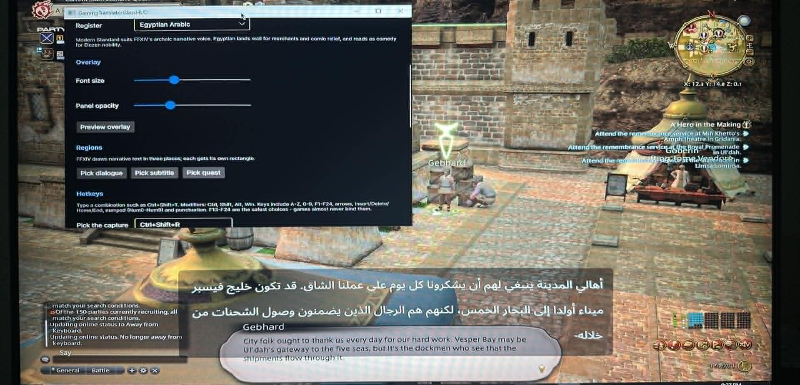
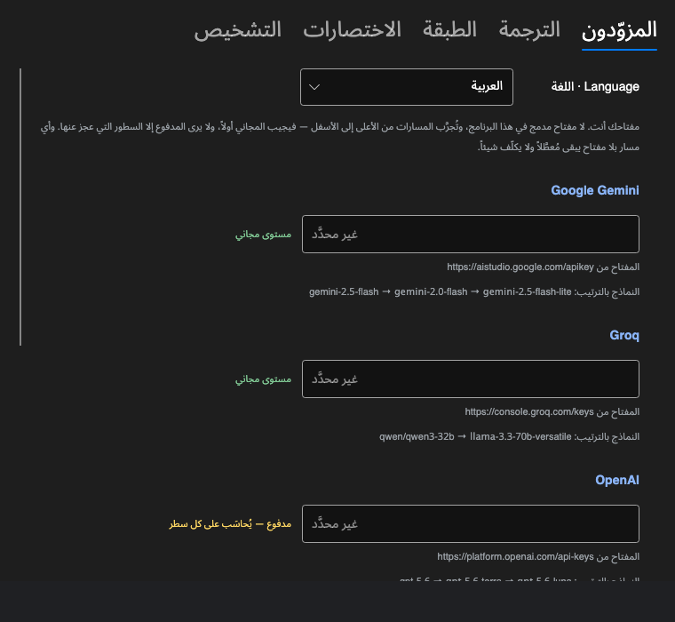
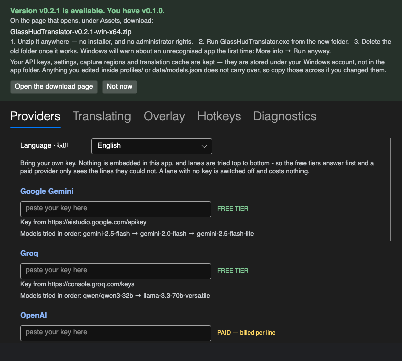
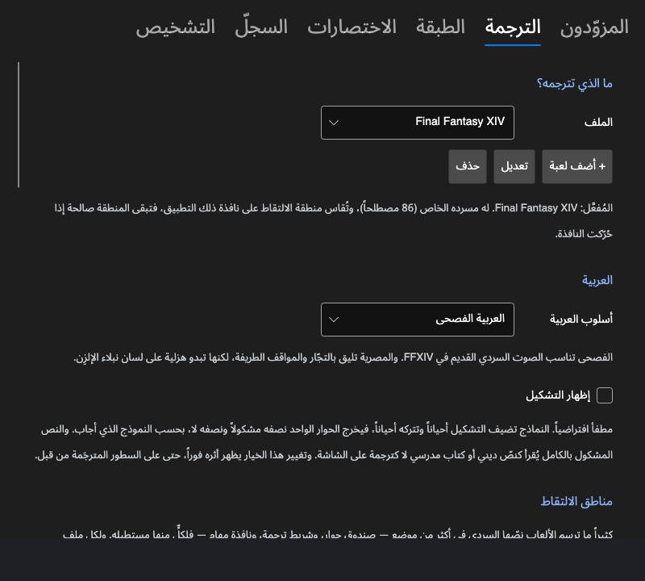
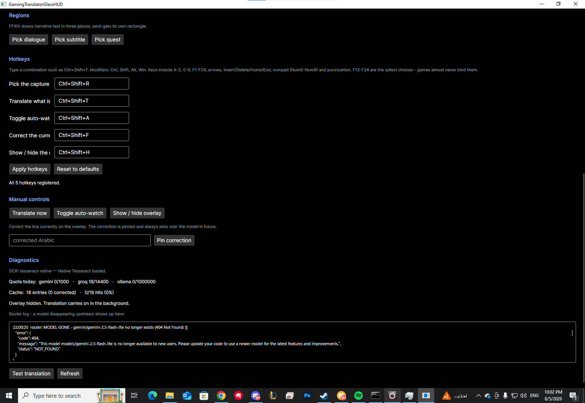
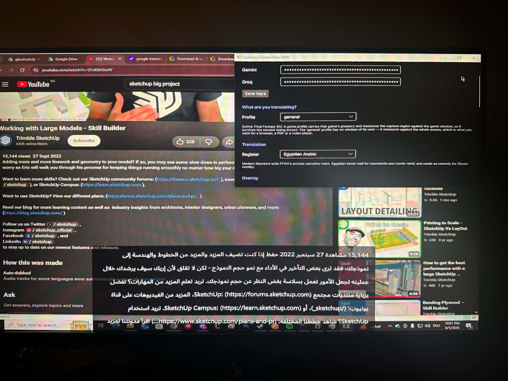
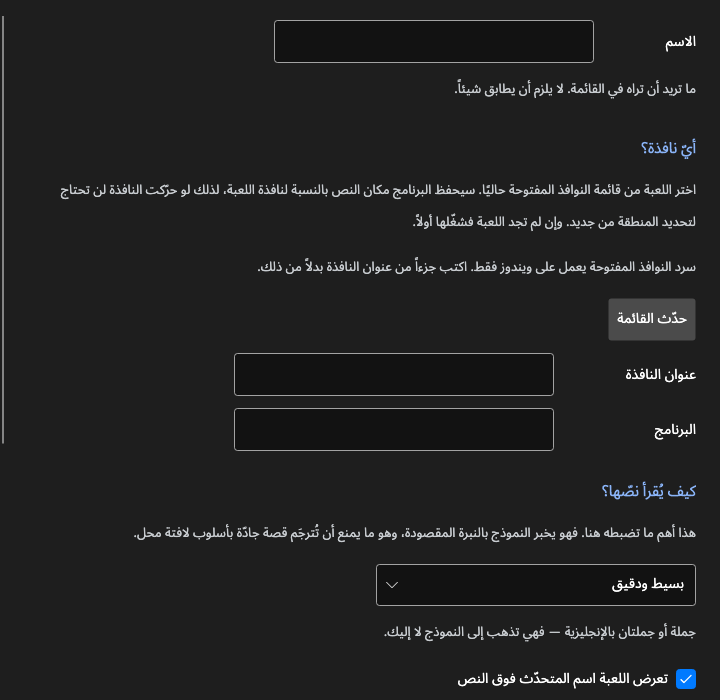

<div align="center">

# Glass HUD Translator

**ترجمة عربية فوق الألعاب التي لا تدعم العربية.**

*ترجمة الألعاب إلى العربية بالذكاء الاصطناعي — فورية، على الشاشة، دون المساس باللعبة.*

[English](README.md) · [العربية](README.ar.md)

[](https://github.com/basel2000de/glass_hud_translator/actions/workflows/build.yml)
[](LICENSE)
[](https://dotnet.microsoft.com/)

</div>

---

<div dir="rtl" align="right">

معظم الألعاب لا تدعم العربية، وما يدعمها منها نادراً ما يترجم قصته. يقرأ Glass HUD Translator
مستطيلاً من شاشتك، ويمرّره على محرّك تعرّف ضوئي على الحروف، ثم يترجم النص بنموذج ذكاء اصطناعي،
ويرسم العربية فوق اللعبة في نافذة شفافة.

لا يمسّ عملية اللعبة إطلاقاً — لا حقن برمجي، ولا قراءة للذاكرة، ولا تعديل ملفات. إنه يقرأ البكسلات
كما تفعل أي لقطة شاشة، فليس فيه ما قد يعرّض حساباً للخطر.

كتبته لشخص يقرأ العربية أسهل بكثير من الإنجليزية، وكان يتابع نصف القصة تقريباً في لعبة قوامها
القصة كلها.

</div>

<div align="center">

<br>
<sub>أثناء التشغيل فوق Final Fantasy XIV. نصّ اللعبة الإنجليزي في الأسفل، والعربية معروضة فوقه.</sub>
</div>

<div dir="rtl" align="right">

## البداية

تحتاج **ويندوز ١٠ أو ١١**، ولعبة تعمل بوضع **النافذة بلا إطار**، ومفتاح واجهة برمجية واحد. لا شيء
غير ذلك — الملف المُنزَّل مكتفٍ ذاتياً، فلا حاجة لتثبيت بيئة تشغيل .NET.

يكفي مفتاح مجاني من [Google AI Studio](https://aistudio.google.com) أو
[Groq](https://console.groq.com)، ولا يطلب أيٌّ منهما بطاقة ائتمان. وإن كنت تدفع أصلاً لـ
[OpenAI](https://platform.openai.com/api-keys) أو
[Anthropic](https://console.anthropic.com/settings/keys) فيمكنك استخدام مفتاحك عندهما بدل ذلك.

**١. نزّل وفُكّ الضغط.** خذ الملف المضغوط من
[Releases](https://github.com/basel2000de/glass_hud_translator/releases)
وفُكّ ضغطه في مجلد عادي مثل `C:\glasshud`. أبقِ المجلد كاملاً كما هو، فالبرنامج يحتاج `tessdata/`
و `profiles/` و `data/` بجواره.

سيمنعه SmartScreen في أول مرة: *More info* ← *Run anyway*. هذا طبيعي لبرنامج غير موقَّع لم يُنزَّل
كثيراً بعد.

**٢. اضبط اللعبة على النافذة بلا إطار.** ملء الشاشة الحصري يعطّل التقاط الشاشة والطبقات العلوية
معاً. ولا تشغّل اللعبة بصلاحيات المدير، وإلا منع ويندوز الطبقة من الرسم فوقها.

**٣. الصق المفتاح.** الإعدادات ← تبويب **المزوّدون** ← الصق ← احفظ. تُخزَّن المفاتيح مشفَّرة بحساب
ويندوز الخاص بك. ويوضّح كل مزوّد إن كان مجانياً أو محاسَباً على كل سطر، ومن أين تحصل على مفتاحه.
وأي مزوّد تتركه فارغاً يبقى مُعطَّلاً.

**واجهة البرنامج بالعربية.** أول عنصر في ذلك التبويب هو لغة الواجهة، ومكتوب بجانبه
**Language · اللغة** بالكتابتين معاً حتى تجده أياً كانت اللغة المعروضة. اخترها فتنقلب الواجهة
كلها إلى العربية ومن اليمين إلى اليسار — التبويبات والعناوين والتخطيط — بالخط العربي المضمَّن في
البرنامج لا بخط قد لا يكون موجوداً على ويندوز. تبقى الإنجليزية هي الافتراضية لأنها ما تعرضه
لقطات الشاشة في هذا الدليل.

وقد مرّت العربية بعدها على قارئ من أهلها، وهذه هي الطريقة الوحيدة التي تظهر بها أخطاء كهذه: كانت
ثلاثة أزرار تقول «حدد dialogue»، لأن أسماء المناطق مفاتيح إنجليزية مخزَّنة، ولصقها بفعل مترجَم
يترك الواجهة نصفين. وكانت خانة المفتاح تقول «غير محدَّد»، وكأن قيمة الإعداد مجهولة لا أنك لم تُدخل
مفتاحاً بعد. وكان اختيار اللهجة معنوناً بـ«المستوى اللغوي»، وهو مصطلح لغويّين لاختيار بين لهجتين
باسميهما. أما الملاحظات الرمادية فكانت بحجم يقول إن لا أحد مضطر لقراءتها، وهي بالضبط ما يقرأه
المستخدم غير التقني ليُكمل الإعداد.

</div>

<div align="center">

<br>
<sub>الواجهة بالعربية. تبقى المفاتيح والروابط وأسماء النماذج من اليسار إلى اليمين، لأنها ليست كلاماً.</sub>
</div>

<div dir="rtl" align="right">

**٤. دلّه على موضع النص.** اضغط `Ctrl+Shift+R`. تتجمّد الشاشة على لقطة ثابتة فلا يتحرّك شيء أثناء
التحديد. ارسم مستطيلاً فوق نص الحوار، واضغط `Space` لترى ما يقرأه المحرّك الضوئي منه بالضبط، وعدّل
حتى تصبح القراءة سليمة، ثم `Enter`. يُخزَّن المستطيل نسبةً إلى نافذة اللعبة، فتحريك النافذة لا يفسده.

**٥. العب.** اضغط `Ctrl+Shift+T` للسطر الظاهر على الشاشة. تظهر العربية خلال ثانية تقريباً، أو
فوراً إن كان السطر قد تُرجم من قبل.

### الاختصارات

| | |
|---|---|
| `Ctrl+Shift+T` | ترجمة ما هو على الشاشة الآن |
| `Ctrl+Shift+A` | تشغيل/إيقاف المتابعة التلقائية — تتبع الحوار وحدها، مناسبة للمشاهد السينمائية |
| `Ctrl+Shift+H` | إظهار/إخفاء الطبقة (تستمر الترجمة في الخلفية) |
| `Ctrl+Shift+R` | إعادة تحديد منطقة الالتقاط |
| `Ctrl+Shift+F` | تصحيح الترجمة الحالية وتثبيت التصحيح |

الخمسة كلها قابلة لإعادة التعيين من الإعدادات ← تبويب **الاختصارات**. المُعدِّلات هي Ctrl و Shift
و Alt و Win، والمفاتيح تشمل A–Z و ٠–٩ و F1–F24 والأسهم و Insert/Delete/Home/End ولوحة الأرقام
وعلامات الترقيم.

**المفاتيح F13–F24 هي الأكثر أماناً**، فهي غير موجودة على لوحات المفاتيح الفعلية، ولذا لا توجد
لعبة تستخدمها.

### استخدام أزرار الفأرة

لا يمكن ربط أزرار الفأرة مباشرة. فدالة `RegisterHotKey` في ويندوز تقبل مفاتيح لوحة المفاتيح فقط،
ودعم أزرار الفأرة يتطلّب اعتراضاً شاملاً لمدخلات النظام — وهو النمط الذي تشير إليه برامج مكافحة
الفيروسات، ويتجنّبه هذا المشروع عن قصد.

استخدم برنامج الفأرة نفسه بدلاً من ذلك (G HUB أو Synapse أو iCUE أو SteelSeries GG، ومعظم
التعريفات العامة تدعم ذلك). اربط الزر الجانبي بتركيبة مفاتيح، ثم اربط تلك التركيبة هنا:

</div>

```
زر الفأرة ٤   ←  Ctrl+F13   (في برنامج الفأرة)
Ctrl+F13      ←  ترجمة ما هو على الشاشة الآن   (في الإعدادات ← الاختصارات)
```

<div dir="rtl" align="right">

### ملاحظات مفيدة

**المتابعة التلقائية للمشاهد السينمائية.** التشغيل اليدوي هو الأصل لأن كل سطر يكلّف طلباً. في
المشاهد الطويلة يتيح `Ctrl+Shift+A` للبرنامج أن يتابع وحده. ويتوقّف بعد ٩٠ ثانية بلا نص جديد، فلا
يستنزف حصتك إن تركته مشغّلاً وابتعدت.

**صحّح الاسم مرة واحدة.** إن خرج اسم شخصية خاطئاً، اضغط `Ctrl+Shift+F` وصحّحه. يُثبَّت التصحيح
ويتقدّم على النموذج في ذلك السطر لاحقاً. أما الاسم المتكرّر كثيراً فأضفه إلى `glossary.json`.

**لا يحدث شيء؟** تبويب **التشخيص** يعرض الحصة المستهلكة اليوم، ونسبة الإصابة في الذاكرة
المؤقتة، ومحرّك القراءة الضوئية الذي حُمِّل فعلاً، وسجلّ الموجِّه الذي يسمّي أي مزوّد أو نموذج
أخفق. وتبويب **المزوّدون** يسرد المسارات بالترتيب الذي ستُجرَّب به ويشير إلى ما لا مفتاح له.

**الطبقة عالقة؟** شغّل `0-force-stop.bat`. الطبقة بلا مدخل في Alt+Tab والنقرات تمرّ خلالها، فلا
توجد نافذة تُغلق — يجب إنهاء العملية.

## التحديثات

مرة كل يوم يسأل البرنامج موقع GitHub إن كانت هناك نسخة أحدث. فإن وُجدت، فُتحت الإعدادات ومعها
إشعار يسمّي الملف الذي تنزّله وما تفعله به. هذا كل ما في الأمر — فهو لا ينزّل ولا يثبّت شيئاً من
تلقاء نفسه.

</div>

<div align="center">

<br>
<sub>شكل الإشعار عند صدور نسخة جديدة. اسم الملف مقروء من الإصدار نفسه، فهو ملف موجود فعلاً.</sub>
</div>

<div dir="rtl" align="right">

**التحديث يدوي عن قصد.** فُكّ ضغط النسخة الجديدة في مكان ما، وشغّلها، ثم احذف المجلد القديم بعد أن
تعمل. أما التحديث التلقائي فقد دُرس ورُفض: ويندوز لا يسمح لبرنامج يعمل بأن يستبدل مكتباته، والنسخة
غير موقَّعة فبرنامج ينزّل ملفاً تنفيذياً ويشغّله هو تحديداً النمط الذي تشير إليه مضادات الفيروسات،
والتحديث التلقائي إذا أخطأ ترك صاحبه ببرنامج لا يعمل ورسالة خطأ بالإنجليزية قد لا يقرؤها.

**إعداداتك تبقى كما هي.** المفاتيح والإعدادات ومناطق الالتقاط والذاكرة المؤقتة محفوظة في حسابك على
ويندوز لا في مجلد البرنامج. أما ما عدّلته داخل `profiles/` أو `data/models.json` فلا ينتقل معك،
فانسخه إن كنت قد غيّرته.

**وهو الطلب الوحيد الذي يرسله البرنامج ولا يكون ترجمة.** ولا يُرسَل معه شيء: لا معرّف ولا بيانات
استخدام ولا مفتاح — مجرّد طلب عادي لصفحة الإصدارات العامة على GitHub، وهي الصفحة نفسها التي
يفتحها متصفّحك. وهو مُفعَّل افتراضياً لأن من كُتب البرنامج لأجله لن يتابع مستودعاً ينتظر إصداراً
جديداً. ولإيقافه: الإعدادات ← **التشخيص** ← **التحديثات**، فلا يُرسَل شيء إطلاقاً.

## ما الذي تضبطه

</div>

<div align="center">

<br>
<sub>أي لعبة، وأي لهجة، وأين يقع النص على الشاشة. ولكل ملف مناطقه الخاصة.</sub>
</div>

<br>

<div align="center">

<br>
<sub>لوحة التشخيص أثناء العمل على ويندوز. هنا التقط سجلّ الموجِّه سحبَ جوجل لأحد النماذج أثناء
الجلسة، فانتقل إلى التالي وواصل الترجمة.</sub>
</div>

<br>

<div align="center">

<br>
<sub>ليس للألعاب وحدها. الطبقة نفسها وهي تقرأ متصفّحاً باستخدام الملف <code>general</code>.</sub>
</div>

<div dir="rtl" align="right">

## الحالة الحالية

في بدايته، لكنه يعمل.

| | |
|---|---|
| مسار الترجمة الكامل (قراءة ← تنظيف ← تخزين ← نموذج لغوي ← عرض) | يعمل، ١٦٩ اختباراً |
| عرض العربية: تشكيل الحروف، الاتجاهان، الحركات | يعمل ومُتحقَّق منه |
| ملفات الألعاب، المسرد، تصحيحات القراءة الضوئية | تعمل |
| التبديل بين مزوّدي الخدمة، تتبّع الحصة، التخزين المؤقت | يعمل |
| التقاط الشاشة، القراءة الضوئية، الاختصارات العامة | **تعمل على ويندوز** |
| عرض الطبقة فوق لعبة قيد التشغيل | **يعمل** |
| الترجمة الكاملة داخل اللعبة | **تعمل** — نحو ثانية واحدة للسطر |
| النقر خلال الطبقة، تحجيم العرض ١٢٥٪ و ١٥٠٪ | لم يُتحقَّق منها بعد |

جُرِّب على **Final Fantasy XIV** على ويندوز: الالتقاط والقراءة الضوئية والاختصارات والطبقة ودورة
الترجمة الكاملة، كلها تعمل مع اللعبة الحيّة بزمن نحو ثانية للسطر.

توقّع بعض الخشونة. لم يُتحقَّق بعد من النقر خلال الطبقة ولا تحجيم العرض فوق ١٠٠٪، والمسرد مسوّدة
أولى، ودقّة القراءة الضوئية مع خط اللعبة الحقيقي لم تُقَس قياساً صحيحاً. أنا أطوّر على macOS وأختبر
على حاسوب محمول مُستعار، لذا تصل إصلاحات ويندوز على دفعات.

## كيف يعمل

</div>

```
التقاط مستطيل  ←  هل تغيّر شيء؟  ←  قراءة ضوئية  ←  تنظيف النص
                        ↓ لا: نتوقف هنا
                                                          ↓
   رسم العربية  ←  نموذج لغوي  ←  إضافة المسرد  ←  هل رأينا هذا السطر سابقاً؟
                                                          ↓ نعم: فوري ومجاني
```

<div dir="rtl" align="right">

أربعة أمور تجعل الفكرة عملية:

**كشف التغيّر قبل القراءة الضوئية.** أثناء الحوار، ٨٥ إلى ٩٠٪ من الإطارات مطابقة تماماً لسابقتها.
المقارنة أولاً بصورة مصغّرة بحجم ٦٤×٢٤ ومحوَّلة إلى أبيض وأسود تُبعد معظم الإطارات عن محرّك القراءة
تماماً، فينخفض زمن الدورة من نحو ١٢٠ جزءاً من الثانية إلى نحو ١٥. والتحويل إلى أبيض وأسود مقصود
وليس مقارنة لدرجات الرمادي، لأن صناديق الحوار عادةً شبه شفافة: انتقل من كهف مظلم إلى ضوء الشمس
وستتغيّر كل بكسل بينما النص لم يتبدّل.

**كل شيء يُخزَّن مؤقتاً.** كل سطر مُترجَم يُحفظ تحت بصمة لنصّه بعد تنظيفه. أعِد قراءة مهمة، أو شاهد
مشهداً مرة أخرى، أو ابدأ بشخصية جديدة، وستأتي الترجمة فورية ومجاناً. كما أن انقطاع الاتصال لا يترك
الشاشة فارغة.

**مسارات متوازية للواجهة البرمجية.** حوار المشاهد السينمائية يتقدّم كل ٣ إلى ٥ ثوانٍ، وهو ما يلامس
تماماً سقف الطلبات في الدقيقة للمستوى المجاني لمزوّد واحد. تشغيل Gemini و Groq كمسارين متوازيين
والانتقال فوراً عند بلوغ حدّ أحدهما يضاعف المتاح ثلاث مرات تقريباً.

**المجاني أولاً، والمدفوع إن أردته.** يأتي البرنامج بأربعة مزوّدين. تُجرَّب المسارات بالترتيب الذي
تظهر به في `data/models.json`، فيجيب المجاني أولاً ولا يرى المدفوع إلا السطور التي عجز عنها
المجاني. وأي مسار بلا مفتاح يبقى مُعطَّلاً ولا يكلّف شيئاً.

| | | |
|---|---|---|
| Google Gemini | مستوى مجاني | لا يحتاج بطاقة |
| Groq | مستوى مجاني | لا يحتاج بطاقة |
| OpenAI | مدفوع | لمن لديه مفتاح أصلاً |
| Anthropic Claude | مدفوع | لمن لديه مفتاح أصلاً |

لا مفتاح مدمج في البرنامج. مفتاحك أنت.

## إضافة لعبتك

الإعدادات ← تبويب **الترجمة** ← **+ أضف لعبة**. بلا ملفات وبلا إعادة تشغيل.

</div>

<div align="center">

<br>
<sub>اختر اللعبة من النوافذ المفتوحة عندك. ولكل ما عداها قيمة افتراضية معقولة.</sub>
</div>

<div dir="rtl" align="right">

ثلاثة أسئلة، والمهم منها الأولان:

**أيّ نافذة.** اختر لعبتك من قائمة النوافذ المفتوحة حاليًا. سيحفظ البرنامج مكان النص بالنسبة
لنافذة اللعبة، لذلك لو حرّكت النافذة لن تحتاج لتحديد المنطقة من جديد. ويُسجَّل اسم البرنامج مع
العنوان، لأن العناوين تتغيّر أثناء اللعب أما `ffxiv_dx11.exe` فلا يتغيّر. واتركها على «أي شيء على
الشاشة» للمتصفّح أو مشغّل الفيديو.

**كيف يُقرأ نصّها.** قائمة: بسيط، فانتازيا جادّة، عصري ودارج، طريف، قوائم وأرقام. وهذا أهم مما
يبدو: النموذج نفسه ينتج عربية مختلفة تماماً بين «ثرثرة عسكرية مقتضبة» و«كلام بلاطي رسمي». وهناك
خانة نصّ حرّ إن أردت أن تصفها بنفسك.

**الأسماء والمصطلحات**، وهي اختيارية ويحسن تخطّيها في البداية. فتوحيد تهجئة أسماء الأعلام هو أقوى
عامل لتحسين الجودة، لكنك لست مضطراً لتذكّرها مسبقاً: اضغط `Ctrl+Shift+F` على سطر خرج فيه اسم خاطئ
فيُثبَّت التصحيح نهائياً.

وبعد الحفظ ينقلك البرنامج مباشرة إلى تحديد منطقة الالتقاط، فالملف بلا منطقة لا يفعل شيئاً بعد.

ويجاورها زرّا **تعديل** و**حذف**. وتعديل ملف يأتي مع البرنامج يحفظ نسختك منفصلة، فلا يستطيع تحديث
أن يمحو عملك، ويبقى الأصل يتحسّن تحتها. أما «أي شيء على الشاشة» فهو الوحيد الذي لا يُحذف — لأنه
البديل الذي يعمل مع كل شيء.

### أين تُحفظ، ومشاركتها

يبقى الملف مجرّد مجلد فيه ثلاثة ملفات نصية، وهذا ما يجعله قابلاً للمشاركة — فضبط شخص واحد للعبة
ضبطاً جيداً يكفي كل من يلعبها:

</div>

```
profile.json           النافذة المرتبط بها، والأسلوب، والمستطيلات الابتدائية
glossary.json          أسماء الأعلام وتهجئتها بالعربية
ocr-corrections.json   الحروف التي يخطئ فيها المحرّك الضوئي مع خط تلك اللعبة
```

<div dir="rtl" align="right">

وملفاتك أنت تُحفظ في `%APPDATA%\GlassHudTranslator\profiles\`، وعن قصد **ليست** في مجلد البرنامج،
فذلك المجلد يُستبدل عند التحديث وكان إعدادك سيذهب معه. أما الملفات التي تأتي مع البرنامج فتبقى في
`profiles/`، وهناك `profiles/_template/` إن فضّلت كتابة واحد بيدك. والمساهمة بملفات ألعاب مرحَّب
بها كثيراً.

### ليس للألعاب وحدها

الالتقاط يقرأ البكسلات من سطح المكتب لا من عملية اللعبة. غيّر الملف إلى **general** من الإعدادات،
فتُقاس المنطقة على الشاشة كاملة بدل نافذة تطبيق بعينه، وبذلك يعمل على المتصفّح، وملفات PDF، وشريط
الترجمة في مشغّل الفيديو، وبرامج المحادثة، وأي شيء يُعرض على الشاشة.

| | ملف اللعبة | `general` |
|---|---|---|
| تُقاس المنطقة على | نافذة اللعبة | الشاشة كاملة |
| يصمد عند تحريك النافذة | نعم | لا — أعد التحديد إن حرّكت شيئاً |
| مسرد أسماء الأعلام | نعم | لا يوجد افتراضياً |
| أسلوب النموذج | مضبوط لكل لعبة | نثر معاصر عادي |

ولكل ملف مناطق التقاطه الخاصة، فيكفي أن تحدّد صندوق الحوار مرة للّعبة وشريط الترجمة مرة لمشغّل
الفيديو — ويستعيد التبديل بينهما المستطيل الصحيح دون إعادة تحديد ودون إعادة تشغيل.

استخدم `general` لقراءة شيء مرة واحدة، واصنع ملفاً خاصاً لما ستعود إليه كثيراً.

### لماذا تظهر Final Fantasy XIV في كل مكان

هي اللعبة التي صمّمتُ عليها واختبرتُ بها، فصارت الملف المرجعي والمثال في معظم الوثائق. وهي حالة
اختبار قاسية: نصوص قصصية كثيفة، وأسماء مليئة بالفواصل العليا يخطئ فيها المحرّك الضوئي مثل
`Y'shtola` و `G'raha Tia`، وصندوق حوار شبه شفاف فوق مشهد ثلاثي الأبعاد متحرّك، ونص يظهر حرفاً حرفاً.
لكن لا شيء في الأداة مرتبط بها.

## التكلفة

لا شيء، في الاستخدام المعتاد. حساب تقريبي لجلسة قصصية مكثّفة:

| | في الساعة |
|---|---|
| أسطر الحوار في اللعب الغنيّ بالمشاهد | ١٠٠ – ٢٠٠ |
| الطلبات الفعلية بعد التخزين المؤقت | نحو ١٢٠ |
| الحصة اليومية المجانية من المزوّدَين المجانيين معاً | نحو ١٥٬٠٠٠ |

ستحتاج إلى اللعب أكثر من يوم متواصل لتستنفدها. والطريقة الواقعية لاستنزاف الحصة ليست طول الجلسة،
بل خطأ برمجي يجعل السطر نفسه يُحسَب ببصمتين مختلفتين فيُدفع ثمنه مرتين — ولهذا كل هذا الاهتمام
بتنظيف النص قبل حساب بصمته.

## جرّبه بلا لعبة

</div>

```bash
git clone https://github.com/basel2000de/glass_hud_translator.git
cd glass_hud_translator
dotnet run --project tools/Replay -- --no-cache
```

<div dir="rtl" align="right">

هذا يشغّل المسار الكامل على إطارات مولَّدة مع مترجم وهمي: بلا مفتاح، وبلا لعبة، وبلا أي اتصال
بالشبكة، ويعمل على macOS و Linux أيضاً. سترى كل مرحلة — ما قرأه المحرّك الضوئي، وكيف نُظِّف النص،
وأي مصطلحات المسرد تطابقت، وما النتيجة.

استبدله بنموذج حقيقي بعد حفظ مفتاح:

</div>

```bash
dotnet run --project tools/Replay -- --provider gemini
```

<div dir="rtl" align="right">

للتأكد من أن العربية تُعرض بشكل صحيح على جهازك:

</div>

```bash
dotnet run --project src/GlassHudTranslator.App -f net10.0 -- --render-test
```

<div dir="rtl" align="right">

## المساهمة

المشكلات وطلبات الدمج مرحَّب بها — انظر [CONTRIBUTING.md](CONTRIBUTING.md). الأنفع حالياً:

- **مراجعة العربية.** مسرد FFXIV مسوّدة أولى ويستفيد كثيراً من عين ناطق بالعربية. الاتساق أهم من
  أي اختيار لفظي بعينه، وهذه أقيَم مساهمة ممكنة الآن.
- **ملفات الألعاب.** لا تحتاج كتابة أي شيفرة — مجلد فيه ثلاثة ملفات JSON.
- **تقارير الأخطاء من اللعب الحقيقي.** جُرِّب على لعبة واحدة وجهاز واحد. التقارير المرفق بها سجلّ
  الموجِّه قيّمة جداً.

ملف [CLAUDE.md](CLAUDE.md) هو دليل التوجيه لمن سيعدّل الشيفرة. يذكر القيود غير الظاهرة من القراءة،
وبعض القواعد التي تبدو تفضيلات شكلية لكنها مسائل صحّة — فتحديد ارتفاع السطر للنص العربي يقصّ
الحركات بصمت، وقصّ النقطتين تحت `ي` يحوّلها إلى حرف آخر.

## أمور مستبعَدة عن قصد

لا حقن في عملية اللعبة، ولا قراءة للذاكرة، ولا أطر إضافات. هذه تعرّض الحسابات للخطر وتتعطّل مع كل
تحديث للعبة. أما قراءة البكسلات من الشاشة فلا علاقة لها بعميل اللعبة إطلاقاً.

ولا واجهات الترجمة الآلية التقليدية أيضاً. فهي أسوأ في كل ما يهمّ هنا: حصص مجانية أصغر، ولا دعم
للمسارد في الخطط المجانية، ولا سياق بين الأسطر، وهي تسطّح صوت اللعبة إلى نثر عام.

## شكر وتقدير

بناء وتوجيه **[Basel](https://github.com/basel2000de)** — البنية المعمارية، وقرارات التصميم،
واستراتيجية المزوّدين والحصص، وتتبّع الأخطاء، وقرارات ما يُصلَح وكيف.

كُتبت الشيفرة بمساعدة ذكاء اصطناعي برمجي (Claude) وفق ذلك التوجيه.

مضمَّن: خط [Noto Sans Arabic](https://github.com/notofonts/arabic) برخصة SIL Open Font License.
مبني على [Tesseract](https://github.com/tesseract-ocr/tesseract) و [Avalonia](https://avaloniaui.net/)
و [SkiaSharp](https://github.com/mono/SkiaSharp). انظر [NOTICE](NOTICE).

## الرخصة

[Apache License 2.0](LICENSE). حرّ للاستخدام والتعديل والتوزيع، تجارياً أيضاً.

</div>
