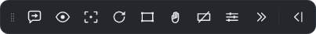
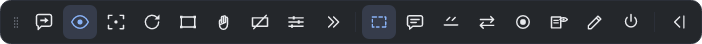
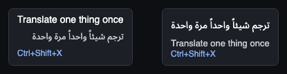

<div align="center">

# Glass HUD Translator

**ترجمة عربية فوق الألعاب التي لا تدعم العربية.**

*ترجمة الألعاب إلى العربية بالذكاء الاصطناعي — فورية، على الشاشة، دون المساس باللعبة.*

[English](README.md) · [العربية](README.ar.md) · [مصري](README.masri.md) · [Deutsch](README.de.md)

[](https://github.com/basel2000de/glass_hud_translator/actions/workflows/build.yml)
[](LICENSE)
[](https://dotnet.microsoft.com/)

</div>

---

<div dir="rtl" align="right">

معظم الألعاب لا تدعم العربية، وما يدعمها منها نادراً ما يترجم قصته. يقرأ Glass HUD Translator
مستطيلاً من شاشتك، ويمرّره على محرّك تعرّف ضوئي على الحروف، ثم يترجم النص بنموذج ذكاء اصطناعي،
ويرسم العربية فوق اللعبة في نافذة شفافة.

لا يمسّ عملية اللعبة إطلاقاً — لا حقن برمجي، ولا قراءة للذاكرة، ولا تعديل ملفات. إنه يقرأ البكسلات
كما تفعل أي لقطة شاشة، فليس فيه ما قد يعرّض حساباً للخطر.

كتبته لشخص يقرأ العربية أسهل بكثير من الإنجليزية، وكان يتابع نصف القصة تقريباً في لعبة قوامها
القصة كلها.

</div>

<div align="center">

<br>
<sub>أثناء التشغيل فوق Final Fantasy XIV. نصّ اللعبة الإنجليزي في الأسفل، والعربية معروضة فوقه.</sub>
</div>

<div dir="rtl" align="right">

### شاهده وهو يعمل

</div>

<div align="center">


<sub>خمسون ثانية داخل Final Fantasy XIV: الترجمة بالاختصار سطراً بسطر أولاً، ثم التحويل إلى المتابعة التلقائية لتتبع الحوار وحدها.</sub>

<br>


<sub>المتابعة التلقائية وحدها أثناء مشهد سينمائي — بلا ضغط أي مفتاح.</sub>

</div>

<div dir="rtl" align="right">

## البداية

تحتاج **ويندوز ١٠ أو ١١**، ولعبة تعمل بوضع **النافذة بلا إطار**، ومفتاح واجهة برمجية واحد. لا شيء
غير ذلك — الملف المُنزَّل مكتفٍ ذاتياً، فلا حاجة لتثبيت بيئة تشغيل .NET.

**والتشغيل الأول يأخذك عبر هذا كله** — اللغة، والمفتاح، واللعبة، ومنطقة الالتقاط — في أربع
خطوات كلها قابلة للتخطي، بالعربية أو الإنجليزية. والخطوات المرقّمة أدناه هي الشيء نفسه يدوياً،
ومرجعٌ لما بعد.

يكفي مفتاح مجاني من [Google AI Studio](https://aistudio.google.com) أو
[Groq](https://console.groq.com)، ولا يطلب أيٌّ منهما بطاقة ائتمان. وإن كنت تدفع أصلاً لـ
[OpenAI](https://platform.openai.com/api-keys) أو
[Anthropic](https://console.anthropic.com/settings/keys) فيمكنك استخدام مفتاحك عندهما بدل ذلك.

**١. نزّل وفُكّ الضغط.** خذ الملف المضغوط من
[Releases](https://github.com/basel2000de/glass_hud_translator/releases)
وفُكّ ضغطه في مجلد عادي مثل `C:\glasshud`. أبقِ المجلد كاملاً كما هو، فالبرنامج يحتاج `tessdata/`
و `profiles/` و `data/` بجواره.

سيمنعه SmartScreen في أول مرة: *More info* ← *Run anyway*. هذا طبيعي لبرنامج غير موقَّع لم يُنزَّل
كثيراً بعد.

**وإن لم يفتح شيء بعدها**، فابحث عن ملف اسمه `startup.log` بجوار البرنامج — يكتبه البرنامج من أول
لحظة يعمل فيها. إن لم يكن الملف موجوداً فالعملية لم تبدأ أصلاً، وغالباً يعني هذا أن مضادّ فيروسات
حذفه: راجع الحجر الصحي عنده، أو أعد فكّ ضغط التنزيل. وإن كان موجوداً فسطره الأخير يقول ما الذي حدث
بالضبط — أرسله مع بلاغك. وصار الفشل في التشغيل يعرض نافذة عادية أيضاً، بالعربية والإنجليزية، والخطأ
فيها جاهز للنسخ — وفيها زرّ **«جرّب الوضع الآمن»** يعيد التشغيل مع تجاهل إعداداتك المحفوظة. فإن
عمل الوضع الآمن فأحد الإعدادات المحفوظة هو المشكلة، ولا شيء تفعله فيه يمسّها.

**٢. اضبط اللعبة على النافذة بلا إطار.** ملء الشاشة الحصري يعطّل التقاط الشاشة والطبقات العلوية
معاً. ولا تشغّل اللعبة بصلاحيات المدير، وإلا منع ويندوز الطبقة من الرسم فوقها.

**٣. الصق المفتاح.** الإعدادات ← تبويب **المزوّدون** ← الصق ← احفظ. تُخزَّن المفاتيح مشفَّرة بحساب
ويندوز الخاص بك. ويوضّح كل مزوّد إن كان مجانياً أو محاسَباً على كل سطر، ومن أين تحصل على مفتاحه.
وأي مزوّد تتركه فارغاً يبقى مُعطَّلاً.

ويمكنك إضافة حتى ثلاثة مفاتيح للمزوّد الواحد بزرّ **+ أضف مفتاحاً آخر**. تُجرَّب بالترتيب قبل
الانتقال إلى المزوّد التالي، فتُستهلك مفاتيح Google كلها قبل أن تُمسّ Groq. وأمر واحد يحدّد إن كان
ذلك مفيداً: الحصة المجانية تخصّ **الحساب** لا المفتاح، فمفتاحان من حساب Google واحد يتقاسمان حصة
واحدة ولا يزيدانك شيئاً. فلا فائدة من مفتاح ثانٍ إلا إذا كان من حساب ثانٍ.

**واجهة البرنامج بالعربية.** أول عنصر في ذلك التبويب هو لغة الواجهة، ومكتوب بجانبه
**Language · اللغة** بالكتابتين معاً حتى تجده أياً كانت اللغة المعروضة. اخترها فتنقلب الواجهة
كلها إلى العربية ومن اليمين إلى اليسار — التبويبات والعناوين والتخطيط — بالخط العربي المضمَّن في
البرنامج لا بخط قد لا يكون موجوداً على ويندوز. تبقى الإنجليزية هي الافتراضية لأنها ما تعرضه
لقطات الشاشة في هذا الدليل.

وقد مرّت العربية بعدها على قارئ من أهلها، وهذه هي الطريقة الوحيدة التي تظهر بها أخطاء كهذه: كانت
ثلاثة أزرار تقول «حدد dialogue»، لأن أسماء المناطق مفاتيح إنجليزية مخزَّنة، ولصقها بفعل مترجَم
يترك الواجهة نصفين. وكانت خانة المفتاح تقول «غير محدَّد»، وكأن قيمة الإعداد مجهولة لا أنك لم تُدخل
مفتاحاً بعد. وكان اختيار اللهجة معنوناً بـ«المستوى اللغوي»، وهو مصطلح لغويّين لاختيار بين لهجتين
باسميهما. أما الملاحظات الرمادية فكانت بحجم يقول إن لا أحد مضطر لقراءتها، وهي بالضبط ما يقرأه
المستخدم غير التقني ليُكمل الإعداد.

</div>

<div align="center">

<br>
<sub>الواجهة بالعربية. تبقى المفاتيح والروابط وأسماء النماذج من اليسار إلى اليمين، لأنها ليست كلاماً.</sub>
</div>

<div dir="rtl" align="right">

**٤. دلّه على موضع النص.** اضغط `Ctrl+Shift+R`. تتجمّد الشاشة على لقطة ثابتة فلا يتحرّك شيء أثناء
التحديد. وبعد لحظة تظهر صناديق خضراء متقطّعة حول المواضع التي يرى فيها البرنامج نصاً — معنونة:
حوار، ترجمة، قائمة مهام، ومعها ثقة القراءة. **انقر أحدها لاستخدامه**، أو ارسم مستطيلك بنفسك فوق نص
الحوار. اضغط `Space` لترى ما يقرأه المحرّك الضوئي بالضبط (ومدى ثقته)، وعدّل حتى تصبح القراءة
سليمة، ثم `Enter`. يُخزَّن المستطيل نسبةً إلى نافذة اللعبة، فتحريك النافذة لا يفسده.

**٥. العب.** اضغط `Ctrl+Shift+T` للسطر الظاهر على الشاشة. تظهر العربية خلال ثانية تقريباً، أو
فوراً إن كان السطر قد تُرجم من قبل.

### الاختصارات

| | |
|---|---|
| `Ctrl+Shift+T` | ترجمة ما هو على الشاشة الآن |
| `Ctrl+Shift+A` | تشغيل/إيقاف المتابعة التلقائية — تتبع الحوار وحدها، مناسبة للمشاهد السينمائية |
| `Ctrl+Shift+H` | إظهار/إخفاء الطبقة (تستمر الترجمة في الخلفية) |
| `Ctrl+Shift+R` | إعادة تحديد منطقة الالتقاط |
| `Ctrl+Shift+F` | تصحيح الترجمة الحالية وتثبيت التصحيح |
| `Ctrl+Shift+S` | فتح الإعدادات دون مغادرة اللعبة |
| `Ctrl+Shift+X` | ترجمة شيء واحد مرة واحدة — ارسم مستطيلاً حول أي شيء على الشاشة |

السبعة كلها قابلة لإعادة التعيين من الإعدادات ← تبويب **الاختصارات**. المُعدِّلات هي Ctrl و Shift
و Alt و Win، والمفاتيح تشمل A–Z و ٠–٩ و F1–F24 والأسهم و Insert/Delete/Home/End ولوحة الأرقام
وعلامات الترقيم.

ولستَ مضطراً إلى حفظ أيٍّ منها: هناك شريط أدوات — انظر أدناه.

**المفاتيح F13–F24 هي الأكثر أماناً**، فهي غير موجودة على لوحات المفاتيح الفعلية، ولذا لا توجد
لعبة تستخدمها.

### استخدام أزرار الفأرة

لا يمكن ربط أزرار الفأرة مباشرة. فدالة `RegisterHotKey` في ويندوز تقبل مفاتيح لوحة المفاتيح فقط،
ودعم أزرار الفأرة يتطلّب اعتراضاً شاملاً لمدخلات النظام — وهو النمط الذي تشير إليه برامج مكافحة
الفيروسات، ويتجنّبه هذا المشروع عن قصد.

استخدم برنامج الفأرة نفسه بدلاً من ذلك (G HUB أو Synapse أو iCUE أو SteelSeries GG، ومعظم
التعريفات العامة تدعم ذلك). اربط الزر الجانبي بتركيبة مفاتيح، ثم اربط تلك التركيبة هنا:

</div>

```
زر الفأرة ٤   ←  Ctrl+F13   (في برنامج الفأرة)
Ctrl+F13      ←  ترجمة ما هو على الشاشة الآن   (في الإعدادات ← الاختصارات)
```

<div dir="rtl" align="right">

### شريط الأدوات

شريط صغير من الأزرار يبقى فوق اللعبة، لكل ما كنت ستحتاج إليه اختصاراً أو نافذة الإعدادات من أجله.
ستة أزرار في البداية — ترجم الآن، تابع تلقائياً، ترجم شيئاً واحداً، اختر المنطقة، أخفِ الترجمة،
الإعدادات — وزرّ سابعٌ يفتح البقية: إطار الالتقاط، والتبديل بين الحوار والفيديو والتلقائي، والتشكيل، وتثبيت
تصحيح، والخروج.

اسحبه من النقاط على حافته لتضعه حيث شئت؛ وهو يتذكّر مكانه. واطوِه إلى مقبض واحد بالزرّ الذي على
طرفه الآخر. وإن كنت تفضّل الاعتماد على الاختصارات فأطفئه من الإعدادات ← **الطبقة**.

</div>

<div align="center">

<br>
<sub>الوضع البسيط: ستة أفعال، وزرّ يوسّع، وزرّ يطوي الشريط إلى مقبض.</sub>
<br><br>

<br>
<sub>بعد التوسيع، والمتابعة التلقائية وإطار الالتقاط مشغّلان — الأزرار الفعّالة تضيء.</sub>
</div>

<div dir="rtl" align="right">

**ومرور المؤشّر فوق أي زرّ يُظهر اسمه بالعربية والإنجليزية معاً**، أياً كانت لغة الواجهة. فالشريط
لا كلام عليه، إنما أشكال — والاسم بلغة واحدة يترك أحدهم يخمّن، ومن هو هذا الأحد أمرٌ لا يُعرف
سلفاً: الصديق الذي يساعد في الإعداد، أم الشخص الذي بُني هذا من أجله.

</div>

<div align="center">

<br>
<sub>الزرّ نفسه: على اليسار والواجهة إنجليزية، وعلى اليمين والواجهة عربية. اللغتان حاضرتان دائماً،
والتي اخترتها هي المتصدّرة. وتبقى تركيبة المفاتيح من اليسار إلى اليمين لأنها ليست كلاماً.</sub>
</div>

<div dir="rtl" align="right">

### تحريك ما يعترض طريقك

اضغط زرّ **اليد** في شريط الأدوات — أو «حرّك العناصر» من الإعدادات ← **الترجمة** — فيصير كلٌّ من
إطار الالتقاط ولوحة الترجمة شيئاً تمسكه بيدك. اسحب أيّهما إلى حيث شئت، وجرّ زاوية الإطار لتغيير
حجمه. ويظهر حول كليهما إطار ما داما مفكوكَين، فترى بنظرة واحدة في أي حال أنت.

اضغطه ثانيةً فيُثبَّتان: يختفي الإطاران ويعود النقر يمرّ إلى اللعبة. وهذه هي الحال الوحيدة التي
يأخذ فيها أيٌّ منهما نقرة، ولذلك هي مفتاح واحد مقصود لا شيء ينزلق إليه البرنامج وحده. وسحب اللوحة
ومزلاجا الموضع شيء واحد: حرّك أحدهما يتبعه الآخر.

### أن ترى ما يجري التقاطه

الإعدادات ← **الطبقة** ← *أظهر ما يجري التقاطه* يرسم إطاراً رفيعاً حول المستطيل الذي يُقرأ. وهو
الجواب على سؤال «هل ينظر إلى المكان الصحيح أصلاً؟» الذي كان تخميناً قبل ذلك.

والنقر يمرّ من خلاله إلى اللعبة، فلا يعترض اللعب. واضغط زرّ الإطار في الشريط مرة أخرى فيصير قابلاً
للإمساك: اسحب من الوسط لتحريكه، ومن الزاوية لتغيير حجمه. ويُحفظ بمجرّد رفع الزرّ — بلا خطوة تأكيد،
لأن ما تعدّله يعرض نتيجته أمامك بالفعل.

ولا يمكن أن يدخل داخل النص الذي يحيط به: الإطار مرسوم خارج المستطيل، وهو — مثل لوحة الترجمة —
مخفيّ عن كل تصوير للشاشة، بما في ذلك تصوير هذا البرنامج نفسه.

### ترجمة شيء واحد

`Ctrl+Shift+X`، أو الزرّ الثالث في الشريط. ارسم مستطيلاً حول أي شيء — وصف غرض، أو لافتة، أو اسم في
قائمة — فيُترجَم بمجرّد رفع الزرّ.

ولا يعطّل ما كان البرنامج يفعله. تستمرّ المتابعة التلقائية وتعود فوراً إلى السطر الذي كانت تتابعه،
وتبقى الترجمة العابرة خارج سياق الحوار في الاتجاهين معاً: وصف غرض لا ينبغي أن يتلوّن بالحوار الذي
كنت تقرأه، ولا أن يوجّه ضمائر السطر التالي بحال.

### ملاحظات مفيدة

**حين يبدو شيء غير طبيعي، شغّل الفحص الشامل.** الإعدادات ← **التشخيص** ← *افحص الآن*. زرّ واحد
يفحص نافذة اللعبة، ووضع ملء الشاشة، وتحجيم العرض، وكل مفتاح (بطلب حقيقي واحد لكل مفتاح)، وقراءة
النص، ومنطقة الالتقاط — ويقول ما وجده بكلمات واضحة، والأسوأ أولاً. وبجواره زرّ **«انسخ تقرير
التشخيص»** يحزم النتائج نفسها مع الإصدار والسجلات والعدّادات، ويضعها في الحافظة ويحفظ نسخة على
سطح المكتب — ألصقه في رسالتك فيكتب البلاغ نفسه بنفسه.

**جرّب المفتاح قبل أن تلعب.** بجانب كل خانة مفتاح زرّ **جرّبه**، يرسل سطراً قصيراً جداً عبر ذلك
المزوّد فتعرف النتيجة هنا لا داخل مشهد سينمائي. وهو يفرّق بين «رُفض هذا المفتاح» و«تعذّر التحقّق
الآن»، والفرق مهم: الأول وحده يعني أنك تحتاج مفتاحاً جديداً. والمفتاح الذي ينجح يُحفَظ فوراً.

**حرّك الطبقة إن كانت تغطّي شيئاً.** في الإعدادات ← تبويب **الطبقة** شريطا موضع، واللوحة تتحرّك وأنت
تسحب. والموضع محسوب داخل نافذة اللعبة، فيبقى كما هو إذا حرّكت اللعبة أو نقلتها إلى شاشة أخرى.

**دعه يستنتج ما ينظر إليه.** في الإعدادات ← **الترجمة** ← «ما الذي على الشاشة» خيار ثالث:
**اكتشفه بنفسك**. فحوار اللعبة وترجمة الفيديو يريدان توقيتَين متعاكسَين — أحدهما ينتظر اكتمال
النص، والآخر لا يملك ترف الانتظار — وهذا يراقب سلوك النص فعلياً ويختار. يلاحظ هل يجلس السطر
منتظراً نقرة، وهل تخلو المنطقة بين سطر وآخر، وهل يستقرّ شيء أصلاً. فيأخذ المشهد السينمائي داخل
اللعبة إيقاع الفيديو دون أن تمدّ يدك إلى قائمة، ويستعيد صندوق الحوار صبره بعده. ويقول تبويب
التشخيص على أيّهما استقرّ.

**المتابعة التلقائية للمشاهد السينمائية.** التشغيل اليدوي هو الأصل لأن كل سطر يكلّف طلباً. في
المشاهد الطويلة يتيح `Ctrl+Shift+A` للبرنامج أن يتابع وحده. وهو ينتظر حتى يستقرّ النص قبل أن
يترجمه، فالسطر الذي يظهر حرفاً حرفاً يكلّف طلباً واحداً لا طلباً عن كل جزء يظهر منه.

وبعد دقيقتين تخبرك على الطبقة أنها ما زالت شغّالة وكم أنفقت، وبعد أربع تُوقف نفسها — أو قبل ذلك إن
أنفقت أكثر مما تنفقه أربع دقائق حوار عادةً. وفي الإعدادات مفتاح يجعلها تعمل بلا حدّ إن أردت.

**تشاهد فيديو؟ قُل له ذلك.** الإعدادات ← **الترجمة** ← *ما الذي على الشاشة*، أو الزرّ نفسه في
شريط الأدوات. ترجمة الفيديو تظهر
كاملة وتختفي بعد ثوانٍ، فانتظار استقرار النص — وهو الصواب مع لعبة تكتب الحوار حرفاً حرفاً — يعني هنا
أن العربية تصل بعد أن يكون السطر قد ذهب. وقد قيس ذلك على صورة متحرّكة: ٤٫٦ ثانية، مقابل ترجمة تعيش
ثلاثاً. وضع الفيديو يتابع أكثر وينتظر أقل بكثير. وهو أيضاً أغلى بكثير: طلب لكل سطر تقريباً، فالفيلم
الواحد شريحة كبيرة من حصة اليوم لا رقم هامشي.

**ويستنتج الإيقاع وحده.** يقيس البرنامج الفواصل بين السطور ويشدّ مهلته تبعاً لها، فيأخذ صندوق الحوار
البطيء وشريط الترجمة السريع توقيتين مختلفين دون أن تختار أنت. وما استنتجه معروض في تبويب التشخيص —
وإن كان النص يصل فعلاً أسرع مما يمكن ترجمته، قال ذلك بدل أن يتخطّى السطور في صمت.

**صحّح الاسم مرة واحدة.** إن خرج اسم شخصية خاطئاً، اضغط `Ctrl+Shift+F` وصحّحه. يُثبَّت التصحيح
ويتقدّم على النموذج في ذلك السطر لاحقاً. أما الاسم المتكرّر كثيراً فأضفه إلى `glossary.json`.

**لا يحدث شيء؟** تبويب **التشخيص** يعرض الحصة المستهلكة اليوم، ونسبة الإصابة في الذاكرة
المؤقتة، ومحرّك القراءة الضوئية الذي حُمِّل فعلاً، وسجلّ الموجِّه الذي يسمّي أي مزوّد أو نموذج
أخفق. وتبويب **المزوّدون** يسرد المسارات بالترتيب الذي ستُجرَّب به ويشير إلى ما لا مفتاح له.

**الطبقة عالقة؟** انقر بيمين الفأرة على أيقونة البرنامج في شريط النظام (بجوار الساعة) ← «أغلق
Glass HUD Translator» — فيُغلق كل شيء بنظافة. الطبقة نفسها بلا مدخل في Alt+Tab والنقرات تمرّ خلالها، فلا
توجد نافذة تُغلق — يجب إنهاء العملية.

## التحديثات

مرة كل يوم يسأل البرنامج موقع GitHub إن كانت هناك نسخة أحدث. فإن وُجدت، فُتحت الإعدادات ومعها
إشعار يسمّي الملف الذي تنزّله وما تفعله به. هذا كل ما في الأمر — فهو لا ينزّل ولا يثبّت شيئاً من
تلقاء نفسه.

</div>

<div align="center">

<br>
<sub>شكل الإشعار عند صدور نسخة جديدة. اسم الملف مقروء من الإصدار نفسه، فهو ملف موجود فعلاً.</sub>
</div>

<div dir="rtl" align="right">

**التحديث يدوي عن قصد.** فُكّ ضغط النسخة الجديدة في مكان ما، وشغّلها، ثم احذف المجلد القديم بعد أن
تعمل. أما التحديث التلقائي فقد دُرس ورُفض: ويندوز لا يسمح لبرنامج يعمل بأن يستبدل مكتباته، والنسخة
غير موقَّعة فبرنامج ينزّل ملفاً تنفيذياً ويشغّله هو تحديداً النمط الذي تشير إليه مضادات الفيروسات،
والتحديث التلقائي إذا أخطأ ترك صاحبه ببرنامج لا يعمل ورسالة خطأ بالإنجليزية قد لا يقرؤها.

**إعداداتك تبقى كما هي.** المفاتيح والإعدادات ومناطق الالتقاط والذاكرة المؤقتة محفوظة في حسابك على
ويندوز لا في مجلد البرنامج. أما ما عدّلته داخل `profiles/` أو `data/models.json` فلا ينتقل معك،
فانسخه إن كنت قد غيّرته.

**وهو الطلب الوحيد الذي يرسله البرنامج ولا يكون ترجمة.** ولا يُرسَل معه شيء: لا معرّف ولا بيانات
استخدام ولا مفتاح — مجرّد طلب عادي لصفحة الإصدارات العامة على GitHub، وهي الصفحة نفسها التي
يفتحها متصفّحك. وهو مُفعَّل افتراضياً لأن من كُتب البرنامج لأجله لن يتابع مستودعاً ينتظر إصداراً
جديداً. ولإيقافه: الإعدادات ← **التشخيص** ← **التحديثات**، فلا يُرسَل شيء إطلاقاً.

## ما الذي تضبطه

</div>

<div align="center">

<br>
<sub>أي لعبة، وأي لهجة، وأين يقع النص على الشاشة. ولكل ملف مناطقه الخاصة.</sub>
</div>

<br>

**لهجتان، والفرق بينهما ليس شكلياً.** الفصحى هي الافتراضية وتناسب الصوت السردي القديم المقصود في
FFXIV. والمصرية هي ما يتحدّث به أكثر الناس فعلاً، وهي أوقع بكثير على ألسنة التجّار والمزاح والمواقف
الطريفة — وإن بدت هزلية على لسان نبلاء الإلزِن، وهذا إمّا عيب فيها وإمّا المقصود منها.

<div align="center">

<br>
<sub>الطبقة نفسها مضبوطة على العامية المصرية. يتغيّر سطر واحد في التعليمات، ولا شيء غيره.</sub>
</div>

<br>

**التشكيل مطفأ افتراضياً.** النماذج تضيف الحركات على غير انتظام — فيخرج الحوار الواحد نصفه مشكولاً
ونصفه لا، بحسب النموذج الذي أجاب — والنص المشكول بالكامل يُقرأ كنصّ ديني أو كتاب مدرسي لا كترجمة
على الشاشة. وفي تبويب الترجمة خيار لتشغيله إن أردته، وأثره يظهر فوراً حتى على السطور المترجَمة من
قبل.

<br>

<div align="center">

<br>
<sub>لوحة التشخيص أثناء العمل على ويندوز. هنا التقط سجلّ الموجِّه سحبَ جوجل لأحد النماذج أثناء
الجلسة، فانتقل إلى التالي وواصل الترجمة.</sub>
</div>

<br>

<div align="center">

<br>
<sub>ليس للألعاب وحدها. الطبقة نفسها وهي تقرأ متصفّحاً باستخدام الملف <code>general</code>.</sub>
</div>

<div dir="rtl" align="right">

## الحالة الحالية

في بدايته، لكنه يعمل.

| | |
|---|---|
| مسار الترجمة الكامل (قراءة ← تنظيف ← تخزين ← نموذج لغوي ← عرض) | يعمل، ٥٧٣ اختباراً |
| عرض العربية: تشكيل الحروف، الاتجاهان، الحركات | يعمل ومُتحقَّق منه |
| ملفات الألعاب، المسرد، تصحيحات القراءة الضوئية | تعمل |
| التبديل بين مزوّدي الخدمة، تتبّع الحصة، التخزين المؤقت | يعمل |
| التقاط الشاشة، القراءة الضوئية، الاختصارات العامة | **تعمل على ويندوز** |
| عرض الطبقة فوق لعبة قيد التشغيل | **يعمل** |
| الترجمة الكاملة داخل اللعبة | **تعمل** — نحو ثانية واحدة للسطر |
| تجربة مفتاح الواجهة البرمجية من الإعدادات | **تعمل** |
| تحريك الطبقة إلى حيث تريدها | **يعمل** |
| لعبة على شاشة ثانية | **تعمل** |
| تحجيم العرض فوق ١٠٠٪ | **يعمل** |
| أكثر من مفتاح للمزوّد الواحد | **يعمل** |
| التشكيل: إظهاره أو إخفاؤه | **يعمل** |
| حدّ زمني للمتابعة التلقائية | **يعمل** |
| وضع ترجمة الفيديو | **يعمل**، ولم يُقَس بعد على فيلم طويل |
| ظهور الطبقة في التسجيل | **يعمل** — مطفأ افتراضياً، انظر الإعدادات ← الطبقة |
| ألّا يُدفَع مرتين عن سطر واحد قُرئ بخطأ طفيف | **يعمل** |
| شريط الأدوات العائم | **يعمل** |
| إطار الالتقاط المرئي | **يعمل** |
| ترجمة شيء واحد مرة واحدة | **يعمل** |
| تحريك الإطار واللوحة باليد | **يعمل** |
| تمييز الحوار من الفيديو تلقائياً | **يعمل**، ولم يُقَس على فيلم طويل بعد |
| النقر خلال الطبقة | لم يُتحقَّق منه بعد |

جُرِّب على **Final Fantasy XIV** وعلى ألعاب أخرى على ويندوز في جلسة طويلة: الالتقاط والقراءة
الضوئية والاختصارات والطبقة ودورة الترجمة الكاملة، كلها تعمل مع اللعبة الحيّة بزمن نحو ثانية
للسطر، وعلى شاشتين وبأكثر من نسبة تحجيم.

توقّع بعض الخشونة. لم يُتحقَّق بعد من النقر خلال الطبقة، والمسرد مسوّدة أولى، ودقّة القراءة الضوئية
مع خط اللعبة الحقيقي لم تُقَس قياساً صحيحاً. أنا أطوّر على macOS وأختبر على حاسوب ويندوز، لذا تصل
إصلاحات ويندوز على دفعات — ولهذا يفصل الجدول أعلاه بين «مكتوب» و«مُتحقَّق منه».

**المتابعة التلقائية بلا حدّ زمني بعد.** ما إن تشغّلها حتى تستمر في الترجمة إلى أن توقفها بنفسك؛
صار لها حدّ يُقاس من لحظة تشغيلها لا من آخر تغيّر — فالقاعدة القديمة كانت تعدّ الوقت **بلا أي نص
جديد**، ولهذا لم تكن تعمل قط فوق فيديو، ولا في لعبة فيها حركة خلف الحوار. تنبّهك على الطبقة بعد
دقيقتين وتتوقّف بعد أربع، بالوقت أو بالإنفاق، أيهما جاء أولاً. ويمكنك تعطيل الحدّ إن شئت.

**مزايا النوافذ الثلاث هي الأحدث هنا والأقل تحقّقاً.** شريط الأدوات وإطار الالتقاط والترجمة
العابرة كُتبت كلها وعُرضت على macOS، والجزء الذي لا يمكن تجريبه هناك هو: هل تستقبل نافذةٌ ترفض أخذ
تركيز لوحة المفاتيح نقرَ الفأرة على ويندوز؟ وكل ما كان سيعتمد على التركيز تُجنِّب عمداً — فالشريط
يحرّك نفسه بنفسه بدل أن يطلب ذلك من مدير النوافذ، والإطار يُحفظ عند رفع الزرّ لا بمفتاح Enter،
وليس على أيٍّ منهما إدخالٌ من لوحة المفاتيح. فإن تبيّن أن الشريط لا يستجيب إطلاقاً، فالعلاج في
الإعدادات ← **الطبقة** ← *اسمح لشريط الأدوات بأخذ التركيز*، وقد صيغ بهذه العبارة لأنها العَرَض
الذي ستراه.

**النماذج المجانية تُسحب دون إنذار، وقد فعلها المزوّدان كلاهما في الأسبوع نفسه.** لذلك تعيش أسماء
النماذج في [`data/models.json`](data/models.json) لا في الشيفرة: حين يسحب مزوّد نموذجاً يكون العلاج
تعديل ملف نصّي، لا انتظار إصدار جديد. فإن توقّفت الترجمة وذكر تبويب التشخيص `MODEL GONE`، فهذا هو
ما جرى.

## كيف يعمل

</div>

```
التقاط مستطيل  ←  هل تغيّر شيء؟  ←  قراءة ضوئية  ←  تنظيف النص
                        ↓ لا: نتوقف هنا
                                                          ↓
   رسم العربية  ←  نموذج لغوي  ←  إضافة المسرد  ←  هل رأينا هذا السطر سابقاً؟
                                                          ↓ نعم: فوري ومجاني
```

<div dir="rtl" align="right">

أربعة أمور تجعل الفكرة عملية:

**كشف التغيّر قبل القراءة الضوئية.** أثناء الحوار، ٨٥ إلى ٩٠٪ من الإطارات مطابقة تماماً لسابقتها.
المقارنة أولاً بصورة مصغّرة بحجم ٦٤×٢٤ ومحوَّلة إلى أبيض وأسود تُبعد معظم الإطارات عن محرّك القراءة
تماماً، فينخفض زمن الدورة من نحو ١٢٠ جزءاً من الثانية إلى نحو ١٥. والتحويل إلى أبيض وأسود مقصود
وليس مقارنة لدرجات الرمادي، لأن صناديق الحوار عادةً شبه شفافة: انتقل من كهف مظلم إلى ضوء الشمس
وستتغيّر كل بكسل بينما النص لم يتبدّل.

**كل شيء يُخزَّن مؤقتاً.** كل سطر مُترجَم يُحفظ تحت بصمة لنصّه بعد تنظيفه. أعِد قراءة مهمة، أو شاهد
مشهداً مرة أخرى، أو ابدأ بشخصية جديدة، وستأتي الترجمة فورية ومجاناً. كما أن انقطاع الاتصال لا يترك
الشاشة فارغة.

**مسارات متوازية للواجهة البرمجية.** حوار المشاهد السينمائية يتقدّم كل ٣ إلى ٥ ثوانٍ، وهو ما يلامس
تماماً سقف الطلبات في الدقيقة للمستوى المجاني لمزوّد واحد. تشغيل Gemini و Groq كمسارين متوازيين
والانتقال فوراً عند بلوغ حدّ أحدهما يضاعف المتاح ثلاث مرات تقريباً.

**المجاني أولاً، والمدفوع إن أردته.** يأتي البرنامج بأربعة مزوّدين. تُجرَّب المسارات بالترتيب الذي
تظهر به في `data/models.json`، فيجيب المجاني أولاً ولا يرى المدفوع إلا السطور التي عجز عنها
المجاني. وأي مسار بلا مفتاح يبقى مُعطَّلاً ولا يكلّف شيئاً.

| | | |
|---|---|---|
| Google Gemini | مستوى مجاني | لا يحتاج بطاقة |
| Groq | مستوى مجاني | لا يحتاج بطاقة |
| OpenAI | مدفوع | لمن لديه مفتاح أصلاً |
| Anthropic Claude | مدفوع | لمن لديه مفتاح أصلاً |

لا مفتاح مدمج في البرنامج. مفتاحك أنت.

## إضافة لعبتك

الإعدادات ← تبويب **الترجمة** ← **+ أضف لعبة**. بلا ملفات وبلا إعادة تشغيل.

</div>

<div align="center">

<br>
<sub>اختر اللعبة من النوافذ المفتوحة عندك. ولكل ما عداها قيمة افتراضية معقولة.</sub>
</div>

<div dir="rtl" align="right">

ثلاثة أسئلة، والمهم منها الأولان:

**أيّ نافذة.** اختر لعبتك من قائمة النوافذ المفتوحة حاليًا. سيحفظ البرنامج مكان النص بالنسبة
لنافذة اللعبة، لذلك لو حرّكت النافذة لن تحتاج لتحديد المنطقة من جديد. ويُسجَّل اسم البرنامج مع
العنوان، لأن العناوين تتغيّر أثناء اللعب أما `ffxiv_dx11.exe` فلا يتغيّر. واتركها على «أي شيء على
الشاشة» للمتصفّح أو مشغّل الفيديو.

**كيف يُقرأ نصّها.** قائمة: بسيط، فانتازيا جادّة، عصري ودارج، طريف، قوائم وأرقام. وهذا أهم مما
يبدو: النموذج نفسه ينتج عربية مختلفة تماماً بين «ثرثرة عسكرية مقتضبة» و«كلام بلاطي رسمي». وهناك
خانة نصّ حرّ إن أردت أن تصفها بنفسك.

**الأسماء والمصطلحات**، وهي اختيارية ويحسن تخطّيها في البداية. فتوحيد تهجئة أسماء الأعلام هو أقوى
عامل لتحسين الجودة، لكنك لست مضطراً لتذكّرها مسبقاً: اضغط `Ctrl+Shift+F` على سطر خرج فيه اسم خاطئ
فيُثبَّت التصحيح نهائياً.

وبعد الحفظ ينقلك البرنامج مباشرة إلى تحديد منطقة الالتقاط، فالملف بلا منطقة لا يفعل شيئاً بعد.

ويجاورها زرّا **تعديل** و**حذف**. وتعديل ملف يأتي مع البرنامج يحفظ نسختك منفصلة، فلا يستطيع تحديث
أن يمحو عملك، ويبقى الأصل يتحسّن تحتها. أما «أي شيء على الشاشة» فهو الوحيد الذي لا يُحذف — لأنه
البديل الذي يعمل مع كل شيء.

### أين تُحفظ، ومشاركتها

يبقى الملف مجرّد مجلد فيه ثلاثة ملفات نصية، وهذا ما يجعله قابلاً للمشاركة — فضبط شخص واحد للعبة
ضبطاً جيداً يكفي كل من يلعبها:

</div>

```
profile.json           النافذة المرتبط بها، والأسلوب، والمستطيلات الابتدائية
glossary.json          أسماء الأعلام وتهجئتها بالعربية
ocr-corrections.json   الحروف التي يخطئ فيها المحرّك الضوئي مع خط تلك اللعبة
```

<div dir="rtl" align="right">

وملفاتك أنت تُحفظ في `%APPDATA%\GlassHudTranslator\profiles\`، وعن قصد **ليست** في مجلد البرنامج،
فذلك المجلد يُستبدل عند التحديث وكان إعدادك سيذهب معه. أما الملفات التي تأتي مع البرنامج فتبقى في
`profiles/`، وهناك `profiles/_template/` إن فضّلت كتابة واحد بيدك. والمساهمة بملفات ألعاب مرحَّب
بها كثيراً.

### ليس للألعاب وحدها

الالتقاط يقرأ البكسلات من سطح المكتب لا من عملية اللعبة. غيّر الملف إلى **general** من الإعدادات،
فتُقاس المنطقة على الشاشة كاملة بدل نافذة تطبيق بعينه، وبذلك يعمل على المتصفّح، وملفات PDF، وشريط
الترجمة في مشغّل الفيديو، وبرامج المحادثة، وأي شيء يُعرض على الشاشة.

| | ملف اللعبة | `general` |
|---|---|---|
| تُقاس المنطقة على | نافذة اللعبة | الشاشة كاملة |
| يصمد عند تحريك النافذة | نعم | لا — أعد التحديد إن حرّكت شيئاً |
| مسرد أسماء الأعلام | نعم | لا يوجد افتراضياً |
| أسلوب النموذج | مضبوط لكل لعبة | نثر معاصر عادي |

ولكل ملف مناطق التقاطه الخاصة، فيكفي أن تحدّد صندوق الحوار مرة للّعبة وشريط الترجمة مرة لمشغّل
الفيديو — ويستعيد التبديل بينهما المستطيل الصحيح دون إعادة تحديد ودون إعادة تشغيل.

استخدم `general` لقراءة شيء مرة واحدة، واصنع ملفاً خاصاً لما ستعود إليه كثيراً.

### لماذا تظهر Final Fantasy XIV في كل مكان

هي اللعبة التي صمّمتُ عليها واختبرتُ بها، فصارت الملف المرجعي والمثال في معظم الوثائق. وهي حالة
اختبار قاسية: نصوص قصصية كثيفة، وأسماء مليئة بالفواصل العليا يخطئ فيها المحرّك الضوئي مثل
`Y'shtola` و `G'raha Tia`، وصندوق حوار شبه شفاف فوق مشهد ثلاثي الأبعاد متحرّك، ونص يظهر حرفاً حرفاً.
لكن لا شيء في الأداة مرتبط بها.

## التكلفة

لا شيء، في الاستخدام المعتاد. حساب تقريبي لجلسة قصصية مكثّفة:

| | في الساعة |
|---|---|
| أسطر الحوار في اللعب الغنيّ بالمشاهد | ١٠٠ – ٢٠٠ |
| الطلبات الفعلية بعد التخزين المؤقت | نحو ١٢٠ |
| الحصة اليومية المجانية من المزوّدَين المجانيين معاً | نحو ٣٬٥٠٠ ترجمة |
| ومثلها عن كل حساب إضافي تضيف مفتاحه | نحو ٣٬٥٠٠ |

ستحتاج إلى اللعب أكثر من يوم متواصل لتستنفدها. والطريقة الواقعية لاستنزاف الحصة ليست طول الجلسة،
بل خطأ برمجي يجعل السطر نفسه يُحسَب ببصمتين مختلفتين فيُدفع ثمنه مرتين — ولهذا كل هذا الاهتمام
بتنظيف النص قبل حساب بصمته. وقد ظهر اثنان من هذا النوع حتى الآن وأُصلحا: سطر واحد يتحوّل إلى عدة
سطور وهو يُكتب على الشاشة حرفاً حرفاً، و Groq يرفض كل طلب ثانٍ في الدقيقة لأن هذا البرنامج كان
يحجز نصف حصتها من الرموز في الدقيقة مع كل طلب.

## جرّبه بلا لعبة

</div>

```bash
git clone https://github.com/basel2000de/glass_hud_translator.git
cd glass_hud_translator
dotnet run --project tools/Replay -- --no-cache
```

<div dir="rtl" align="right">

هذا يشغّل المسار الكامل على إطارات مولَّدة مع مترجم وهمي: بلا مفتاح، وبلا لعبة، وبلا أي اتصال
بالشبكة، ويعمل على macOS و Linux أيضاً. سترى كل مرحلة — ما قرأه المحرّك الضوئي، وكيف نُظِّف النص،
وأي مصطلحات المسرد تطابقت، وما النتيجة.

استبدله بنموذج حقيقي بعد حفظ مفتاح:

</div>

```bash
dotnet run --project tools/Replay -- --provider gemini
```

<div dir="rtl" align="right">

للتأكد من أن العربية تُعرض بشكل صحيح على جهازك:

</div>

```bash
dotnet run --project src/GlassHudTranslator.App -f net10.0 -- --render-test
```

<div dir="rtl" align="right">

## من أين تأتي الملاحظات

لا يوجد لهذا المشروع متتبّع أخطاء بأي معنى مفيد. فمن كُتب لهم لا حسابات لهم على GitHub، ومطالبتهم
بفتح تقرير هناك مطالبةٌ بتعلّم أداة أصعب من الأداة التي جاؤوا من أجلها. لذلك يُنشَر في مجموعات
الألعاب العربية، وخيط التعليقات هو متتبّع الأخطاء.

</div>

<div align="center">

<br>
<sub>المنشور الذي جاء منه أكثر المستخدمين الحاليين — أكثر من تسعمائة تفاعل، ومئات التعليقات، ونحو
خمسمائة تنزيل للإصدار الذي أشار إليه.</sub>
</div>

<br>

<div dir="rtl" align="right">

ومن هناك جاء أغلب ما في الإصدارات الأخيرة، ولم يصل شيء منه في صورة تقرير خطأ. وصل في صورة شخص يصف
ما رآه بكلماته هو — *الترجمة تغطّي النص الذي أريد قراءته*، *يقول تعذّرت الترجمة مع أن مفتاحي يعمل* —
وهذا أصعب في التشخيص وأثمن في التلقّي، لأنه التجربة نفسها لا نظرية أحدهم عن سببها. أشرطة تحريك
الطبقة، والمفتاح الذي كانت تجربته تنجح دون أن يُحفَظ قط، و Groq الذي كان هذا البرنامج يخنقه لا
Groq نفسها — كلها بدأت هكذا.

ولهذا صيغت الوثائق على ما هي عليه: ثلاثة ملفات تعريف، أحدها دليل بالعامية المصرية بلا مصطلحات، وواجهة
يمكن تحويلها إلى العربية قبل أن تُدخل أي شيء. فمن لا يستطيع قراءة تعليمات الإعداد لم يُعطَ أداة.

أما السبب الشخصي، وللمصادر المفتوحة سبب شخصي عادةً: ترجمات الألعاب وطبقاتها جزء كبير مما تعلّمت به
الإنجليزية طفلاً، في سنّ ما كان شيء آخر ليُبقي انتباهي كل تلك الساعات. فإن أتاح هذا لبضعة أشخاص وقتاً
أفضل بلغتهم، فذلك ردٌّ للدَّين في الاتجاه الذي يمكن ردّه فيه.

## المساهمة

المشكلات وطلبات الدمج مرحَّب بها — انظر [CONTRIBUTING.md](CONTRIBUTING.md). الأنفع حالياً:

- **مراجعة العربية.** مسرد FFXIV مسوّدة أولى ويستفيد كثيراً من عين ناطق بالعربية. الاتساق أهم من
  أي اختيار لفظي بعينه، وهذه أقيَم مساهمة ممكنة الآن.
- **ملفات الألعاب.** لا تحتاج كتابة أي شيفرة — مجلد فيه ثلاثة ملفات JSON.
- **تقارير الأخطاء من اللعب الحقيقي.** جُرِّب على لعبة واحدة وجهاز واحد. التقارير المرفق بها سجلّ
  الموجِّه قيّمة جداً.

ملف [CLAUDE.md](CLAUDE.md) هو دليل التوجيه لمن سيعدّل الشيفرة. يذكر القيود غير الظاهرة من القراءة،
وبعض القواعد التي تبدو تفضيلات شكلية لكنها مسائل صحّة — فتحديد ارتفاع السطر للنص العربي يقصّ
الحركات بصمت، وقصّ النقطتين تحت `ي` يحوّلها إلى حرف آخر.

## أمور مستبعَدة عن قصد

لا حقن في عملية اللعبة، ولا قراءة للذاكرة، ولا أطر إضافات. هذه تعرّض الحسابات للخطر وتتعطّل مع كل
تحديث للعبة. أما قراءة البكسلات من الشاشة فلا علاقة لها بعميل اللعبة إطلاقاً.

ولا واجهات الترجمة الآلية التقليدية أيضاً. فهي أسوأ في كل ما يهمّ هنا: حصص مجانية أصغر، ولا دعم
للمسارد في الخطط المجانية، ولا سياق بين الأسطر، وهي تسطّح صوت اللعبة إلى نثر عام.

## شكر وتقدير

بناء وتوجيه **[Basel](https://github.com/basel2000de)** — البنية المعمارية، وقرارات التصميم،
واستراتيجية المزوّدين والحصص، وتتبّع الأخطاء، وقرارات ما يُصلَح وكيف.

كُتبت الشيفرة بمساعدة ذكاء اصطناعي برمجي (Claude) وفق ذلك التوجيه.

مضمَّن: خط [Noto Sans Arabic](https://github.com/notofonts/arabic) برخصة SIL Open Font License.
مبني على [Tesseract](https://github.com/tesseract-ocr/tesseract) و [Avalonia](https://avaloniaui.net/)
و [SkiaSharp](https://github.com/mono/SkiaSharp). انظر [NOTICE](NOTICE).

## الرخصة

[رخصة جنو AGPL 3.0](LICENSE)، ابتداءً من الإصدار 0.6.0. حرّ في الاستخدام والدراسة والتعديل
والمشاركة، بشرط واحد: أن يبقى كل ما يُبنى عليه مفتوحاً بالطريقة نفسها. فإن وزّعت نسخة معدَّلة، أو
شغّلتها بحيث يستخدمها آخرون عبر الشبكة، فمن حقّ مستخدميها أن يحصلوا على شيفرتك كذلك.

**وكل ما صدر حتى الإصدار 0.5.3 يبقى تحت رخصة Apache 2.0**، ولا سبيل إلى الرجوع في ذلك. فإن كانت
تلك الشروط تناسبك فالشيفرة ما زالت موجودة تحت وسمها، وما زالت لك تفعل بها ما تشاء.

والتغيير ليس عن المال — فلا أحد يُطالَب بدفع شيء هنا، ومفتاح المزوّد مفتاحك أنت. إنما هو أن يبقى
العمل متاحاً لمن كُتب من أجلهم. فبرنامج يترجم لقارئ أُقصي عن ألعابه لا ينبغي أن يكون شيئاً يُغلَق
ويُعاد تلوينه ثم يُباع له.

</div>
