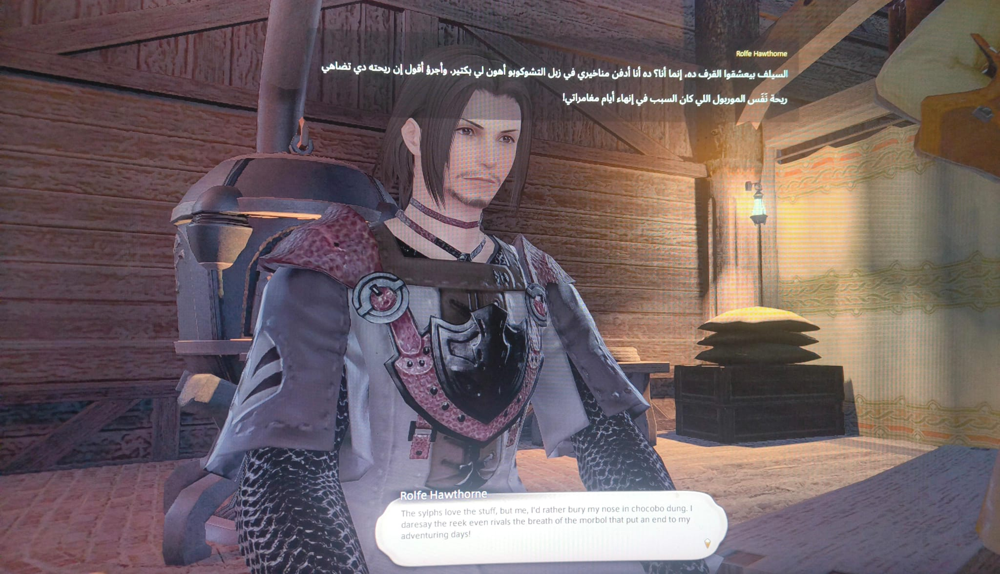

# Glass HUD Translator

**ترجمة عربية فوق الألعاب اللي مفيهاش عربي.**

*بيقرأ الكلام اللي ظاهر في اللعبة، يترجمه بالـAI، ويحطه فوق اللعبة.*

[English](README.md) · [العربية الفصحى](README.ar.md) · [مصري](README.masri.md) · [Deutsch](README.de.md)

---

الصفحة دي بالمصري ومكتوبة للّي هيستخدم البرنامج. لو بتدور على التفاصيل التقنية أو عايز تساهم
في الكود، النسخة [بالفصحى](README.ar.md) أو [بالإنجليزي](README.md) فيها الكلام ده.

## الحكاية

ده برنامج لمساعدة الناس اللي عايزة تلعب ألعاب قصة ومش بتتكلم إنجليزي.

وأنا صغير، قبل ما أتعلم إنجليزي كويس، الألعاب اللي مفيهاش عربي كان عندي معاها حل من اتنين: يا إما
أعمل skip للكلام كله، يا إما أفضل أترجم كلمة كلمة عشان أفهم إيه اللي بيحصل.

من فترة كنت بلعب **Final Fantasy XIV** مع حد أعرفه ولقيته تقريباً بيعمل نفس الحاجة، واللعبة دي
بالذات كمية الكلام والقصة فيها مش قليلة خالص. فكنت عايز طريقة تخليه يلعب عادي ويقرأ الترجمة قدامه
من غير ما يخرج كل شوية من اللعبة.

فعملت البرنامج ده.

 
الكلام الإنجليزي بتاع اللعبة تحت، والعربي فوقه.

### شوفه شغّال

أسرع طريقة تفهم البرنامج بيعمل إيه إنك تشوفه بعينك:

خمسين ثانية جوه Final Fantasy XIV: بيترجم بالاختصار سطر سطر الأول، وبعدين بيحوّل على الترجمة التلقائية وتمشي لوحدها.

 

الترجمة التلقائية لوحدها في cutscene — من غير ما تدوس أي حاجة.

## هو بيعمل إيه بالظبط

ببساطة بيقرأ الكلام اللي ظاهر في اللعبة، يبعته لـAI يترجمه، ويحط العربي فوق اللعبة.

استخدام الـAI هنا كان مهم بالنسبالي عشان الترجمة تبقى جمل مفهومة وطبيعية شوية بدل ترجمة كلمة
بكلمة، وكمان البرنامج يقدر يعرف أسماء ومصطلحات اللعبة ويحافظ عليها. وتقدر تختار الترجمة **فصحى**
ولا **مصري**.

جربته لحد دلوقتي فعلياً على FFXIV، والسطر غالباً بياخد حوالي **ثانية**. ولو نفس السطر اتشاف قبل
كده بيطلع على طول.

**ومش Mod ولا Plugin.** مش بيعدل حاجة في ملفات اللعبة ولا بيدخل جواها. هو بس بيقرأ اللي ظاهر على
الشاشة ويحط الترجمة فوقها — زي ما تكون بتاخد screenshot. فمفيش حاجة فيه تعرّض حسابك لأي مشكلة.

البرنامج نفسه **عربي أو إنجليزي**، وتقدر تضيف أي لعبة من جواه.

## اللي محتاجه

- **ويندوز ١٠ أو ١١**
- اللعبة شغالة **Borderless Windowed** (مش Fullscreen، دي بتوقف التصوير والطبقة اللي فوق اللعبة)
- **API key واحد** — مجاني وببلاش، والخطوات تحت

مش محتاج تنزّل .NET ولا أي حاجة تانية، الملف جاهز.

## التشغيل

### ١. نزّل وفك الضغط

نزّل الـZIP من [صفحة التحميل](https://github.com/basel2000de/glass_hud_translator/releases/latest)
وفك ضغطه في مجلد عادي زي `C:\glasshud`. سيب المجلد كامل زي ما هو، البرنامج محتاج الملفات اللي جنبه.

أول مرة تشغله ويندوز هيطلعلك تحذير إن البرنامج مش معروف — ده طبيعي لأي برنامج مش موقّع.
اضغط **More info** بعدين **Run anyway**.

### ٢. هات الـAPI key

الـAPI key ده اللي بيخلي البرنامج يقدر يترجم. فيه اتنين مجانيين ومش طالبين Credit Card،
و**واحد منهم بس كفاية**:

**Gemini** — [aistudio.google.com/apikey](https://aistudio.google.com/apikey)
تدخل بحساب Google ← Create API Key ← Copy.

**Groq** — [console.groq.com/keys](https://console.groq.com/keys)
تعمل Account ← Create API Key ← Copy.

بعدها افتح البرنامج ← **المزوّدون / Providers** ← الصق الـkey مكان Gemini أو Groq ← احفظ.

وجنب كل خانة فيه زرار **«جرّبه»**. دوسه بعد ما تحفظ وهو هيقولك على طول:
**«يعمل»** يبقى تمام وإنت جاهز، و**«رُفض هذا المفتاح»** يبقى غالباً النسخ ناقص حرف أو المفتاح
اتلغى، و**«تعذّر التحقّق الآن»** معناها إن النت هو اللي مش راضي يوصل — **مش** إن المفتاح غلط،
فمتروحش تعمل مفتاح جديد على الفاضي. أحسن ما تكتشف إن فيه حاجة غلط وإنت جوه اللعبة.

لو حطيت الاتنين، البرنامج يقدر ينتقل للتاني لو الأول وقف أو وصل للـlimit.

**ولو عايز تلعب أكتر من كده:** تقدر تحط لحد **٣ مفاتيح لكل مزوّد**، من الزرار اللي مكتوب عليه
**«+ أضف مفتاحاً آخر»**. البرنامج بيجرّبهم واحد ورا التاني قبل ما ينتقل للمزوّد اللي بعده، يعني
مفاتيح Gemini كلها الأول وبعدين Groq.

بس في حاجة مهمة لازم تعرفها قبل ما تعمل كده: **الحصة المجانية بتاعة الحساب مش بتاعة المفتاح.**
يعني لو عملت مفتاحين من نفس حساب Google، الاتنين بيقسّموا نفس الحصة وإنت كده مكسبتش حاجة. المفتاح
التاني مايفيدك إلا لو من **حساب تاني**.

وفيه كمان **OpenAI** و**Claude** لو حد عنده API key بتاعهم أصلاً، بس مش محتاجهم خالص —
والاتنين دول بيتحاسبوا على كل سطر، فالبرنامج بيجرب المجاني الأول دايماً.

 
أول حاجة في الشاشة دي هي لغة البرنامج نفسه — <code>Language · اللغة</code> — مكتوبة بالكتابتين عشان تلاقيها أياً كانت اللغة الظاهرة.

### ٣. ورّيه الكلام بيظهر فين

خلي اللعبة شغالة وافتح البرنامج، واضغط **`Ctrl + Shift + R`**.

البرنامج هيوقّف الصورة قدامك كأنك أخدت screenshot، وبعدها بالماوس اضغط واسحب مربع على المكان اللي
الحوار بيظهر فيه كل مرة. يعني لو صندوق الكلام تحت الشاشة، حدد الصندوق نفسه وخلاص.

قبل ما تحفظ تقدر تضغط **`Space`** وتشوف البرنامج قرا الكلام صح ولا لأ. ولما المنطقة تبقى مظبوطة
اضغط **`Enter`**.

**ولو حرّكت نافذة اللعبة بعد كده عادي** — البرنامج حافظ مكان الحوار بالنسبة لنافذة اللعبة نفسها،
مش بالنسبة للشاشة كلها، فمش محتاج تعيد التحديد لمجرد إنك حركت اللعبة.

ولو اللعبة بتطلّع الكلام في أكتر من مكان، زي FFXIV مثلاً: مرة صندوق حوار تحت، مرة subtitles في
الـcutscene، ومرة كلام الـquest في مكان تاني — تقدر تحدد لكل واحد مكان لوحده من البرنامج.

ولو غيّرت الـUI بتاع اللعبة أو مكان الحوار نفسه اتغير فعلاً، مفيش مشكلة: اضغط `Ctrl + Shift + R`
تاني وحدد المكان الجديد.

### ٤. حطّ الترجمة في المكان اللي يريحك

الترجمة بتظهر تحت في نص الشاشة. لو لقيتها بتغطّي كلام اللعبة أو أي حاجة محتاج تشوفها، تقدر
تحرّكها: **الإعدادات ← الطبقة**، وهتلاقي شريطين — واحد يطلّعها وينزّلها، والتاني يودّيها يمين
وشمال.

اضغط **«معاينة الطبقة»** الأول عشان تشوفها قدامك، وبعدين اسحب الشريط وهي هتتحرّك معاك على طول.
ولو تاهت منك خالص فيه زرار **«أعدها إلى الوسط»**.

والمكان اللي هتختاره محسوب **جوّه نافذة اللعبة** مش على الشاشة، يعني لو حرّكت اللعبة أو نقلتها على
شاشة تانية، الترجمة هتفضل في نفس المكان بالنسبة للّعبة.

## الاختصارات

| | |
|---|---|
| **`Ctrl + Shift + T`** | يترجم الكلام اللي ظاهر دلوقتي |
| **`Ctrl + Shift + A`** | يشغّل الترجمة التلقائية — كل ما يظهر كلام جديد يترجمه لوحده. دي أحسن حاجة للـcutscenes |
| **`Ctrl + Shift + H`** | يخفي أو يظهّر الترجمة |
| **`Ctrl + Shift + R`** | تعيد تحديد مكان الكلام |
| **`Ctrl + Shift + F`** | لو ترجمة سطر طلعت غلط، تصلّحها ويحفظ التصحيح |
| **`Ctrl + Shift + S`** | يفتحلك الإعدادات وإنت في اللعبة |
| **`Ctrl + Shift + X`** | تحوّط بالماوس على أي حاجة على الشاشة فيترجمهالك مرة واحدة |

السبعة كلهم تقدر تغيّرهم من البرنامج لو واحد منهم متعارض مع حاجة في اللعبة.

**بس إنت أصلاً مش محتاج تحفظهم.** فيه شريط أزرار بيقعد فوق اللعبة، اقرا تحت.

## شريط الأزرار

شريط صغيّر بيفضل فوق اللعبة، فيه كل حاجة كنت هتحتاج تفتحله الإعدادات أو تحفظله اختصار.

ستة أزرار في الأول: **ترجم دلوقتي** · **تابع لوحدك** · **ترجم حاجة واحدة** · **اختار المكان** ·
**اخفي الترجمة** · **الإعدادات**. وفيه زرار سابع بيفتحلك الباقي لو احتجته.

- **اسحبه من النقط اللي على طرفه** وحطّه في أي مكان يريحك، وهو هيفتكر مكانه.
- **الزرار اللي على الطرف التاني بيطويه** ويخليه مقبض صغير لوحده لو زهقت منه.
- **حطّ الماوس فوق أي زرار** يقولك بيعمل إيه — **بالعربي والإنجليزي مع بعض**، مهما كانت لغة
  البرنامج. لأن الشريط مافيهوش كلام أصلاً، أشكال بس؛ فلو الاسم بلغة واحدة يبقى حد هيقعد يخمّن.
- ولو مش عايزه خالص، اقفله من **الإعدادات ← الطبقة**.

## تشوف هو بيصوّر فين بالظبط

من **الإعدادات ← الطبقة ← «أظهر ما يجري التقاطه»** هيرسملك برواز رفيع حوالين المكان اللي بيقراه.
دي إجابة سؤال «هو أصلاً بيبص على المكان الصح ولا لأ؟» اللي كان تخمين قبل كده.

النقر بيعدّي من خلاله عادي، فمش هيعطّلك وإنت بتلعب. ولو دوست زرار البرواز في الشريط تاني، تقدر
تمسكه: اسحب من النص عشان تحركه، ومن الركن عشان تكبّره أو تصغّره. وأول ما تسيب الماوس بيتحفظ لوحده،
من غير ما تدوس «حفظ» — لأن اللي إنت بتعدّله قدامك وإنت شايف نتيجته.

وماتقلقش إنه يدخل جوه الكلام: البرواز مرسوم من بره المستطيل، وزيه زي لوحة الترجمة مخفي عن أي تصوير
للشاشة، حتى تصوير البرنامج لنفسه.

## ترجمة حاجة واحدة بس

`Ctrl + Shift + X`، أو تالت زرار في الشريط. حوّط بالماوس على أي حاجة — وصف سلاح، لافتة، اسم في
قايمة — وأول ما تسيب الزرار يترجمهالك.

ومش هيلخبط اللي البرنامج كان بيعمله: الترجمة التلقائية بتفضل شغالة وبترجع فوراً للكلام اللي كانت
بتتابعه. والحاجة اللي ترجمتها كده بتفضل لوحدها، مابتدخلش في سياق الحوار ولا بتأثر على السطر اللي
بعده.

الترجمة التلقائية دلوقتي بتستنى الكلام يخلص ما يظهر قبل ما تترجمه. الألعاب زي FFXIV بتكتب الكلام
حرف حرف، وقبل كده كان البرنامج بيترجم السطر الواحد أربع أو خمس مرات وهو بيتكتب — يعني بيدفع أربع
طلبات عشان يوريك أربع نسخ ناقصة من نفس الجملة. خلاص بقى طلب واحد.

وبقا ليها **حدّ بالوقت** كمان: بعد دقيقتين هتقولك على الشاشة إنها لسه شغالة وكام ترجمة عملت، وبعد
أربع دقايق هتقفل نفسها. لو عايزها تفضل شغالة من غير حدّ، فيه اختيار في الإعدادات.

**ولو بتتفرّج على فيديو:** روح **الإعدادات ← الاختصارات ← «ما الذي على الشاشة»** واختار **«ترجمة
فيديو»**. ترجمة الفيديو بتظهر كاملة ومابتقعدش غير تلات أربع ثواني، فالبرنامج لو استنى الكلام يستقر
— وده الصح في الألعاب — الترجمة بتوصل بعد ما السطر يكون مشي خلاص. في وضع الفيديو بيبص أكتر وبيستنى
أقل بكتير.

بس خد بالك: **الفيديو غالي.** يعني طلب لكل سطر ترجمة تقريباً، والفيلم الواحد ممكن ياكل جزء كبير من
حصتك اليومية المجانية. مش زي اللعب العادي خالص.

**وكمان بقا بيتعلّم الإيقاع لوحده.** بيحسب الوقت بين السطر والتاني ويظبط نفسه عليه، فاللعبة البطيئة
والفيديو السريع كل واحد بياخد توقيت مختلف من غير ما تعمل إنت حاجة. وتقدر تشوف هو فهم إيه من
**التشخيص**.

بس خلّي بالك برضه: **كل سطر بيتحسب من حصتك.** لو خلصت اللي إنت عايزه، اقفلها بـ`Ctrl + Shift + A`
تاني ماتستناش الحدّ.

**وحاجة كمان بتوفّرلك:** أحياناً الكلام مابيتغيّرش خالص بس القراءة بتطلع مختلفة شوية — فاصلة بتتقرا
نقطة، حرف بيتقرا غلط. قبل كده ده كان بيتحسب سطر جديد ويتدفع تاني. دلوقتي البرنامج بيقارن الكلام
نفسه، ولو هو نفس السطر تقريباً مابيبعتش حاجة. ودي بتفرق أكتر حاجة في الفيديو، لأن الصورة ورا الترجمة
بتتغير على طول والكلام ثابت.

## الفصحى ولا المصري؟

من **الإعدادات ← الترجمة** تقدر تختار الترجمة تطلعلك بالفصحى ولا بالعامية المصرية.

**الفصحى** هي الافتراضية، وهي اللي بتليق بالكلام القديم الجادّ اللي في FFXIV. و**المصري** أقرب
لطريقة كلامنا وبيضحك في مشاهد التجّار والهزار — بس ساعات بيطلع مضحك على لسان شخصية المفروض تكون
مهيبة، وده يرجعلك إنت.

 
نفس الترجمة بس بالمصري. تغيّر الاختيار من الإعدادات وخلاص.

### والتشكيل؟

في نفس الشاشة فيه اختيار اسمه **«إظهار التشكيل»**، وهو **مقفول** من الأول.

سببه إن النماذج مكانتش ثابتة على حاجة: سطر يجيلك مشكول وسطر لأ، في نفس الحوار، على حسب أنهي نموذج
ردّ. وغير كده النص المشكول كله بيبقى شكله زي كتاب المدرسة أو المصحف مش زي ترجمة على شاشة.

لو عايزه، شغّله — والتغيير بيبان على طول، حتى على السطور اللي اتترجمت قبل كده.

## تضيف لعبتك إزاي

لو اللعبة مش موجودة عندك في القائمة: **الإعدادات ← الترجمة ← `+ أضف لعبة`**.

تختار اللعبة وهي مفتوحة من قائمة النوافذ، تختار شكل الكلام في اللعبة (قصة جادّة، كلام عادي، هزار،
قوايم وأرقام)، وبعد ما تحفظ البرنامج بياخدك على طول لتحديد مكان الكلام.

الموضوع مش محتاج تعمل أي ملفات أو إعدادات بره البرنامج.

 
اختار اللعبة وهي مفتوحة، وباقي الحاجات ليها قيم افتراضية معقولة.

فيه كمان جدول اختياري للأسماء — لو عايز اسم شخصية أو مكان يتكتب بنفس الطريقة كل مرة. ومش لازم
تفكر فيه من الأول: أول ما اسم يطلع غلط اضغط `Ctrl + Shift + F` وصلّحه، والبرنامج هيفتكره.

## مش للألعاب بس

البرنامج بيقرأ الشاشة، مش اللعبة. يعني نفس الحاجة تشتغل على متصفّح، أو ملف PDF، أو ترجمة فيديو،
أو أي حاجة ظاهرة قدامك. اختار **«أي شيء على الشاشة»** من قائمة الألعاب وحدد المكان بنفس الطريقة.

ولكل واحدة في القائمة المناطق بتاعتها لوحدها، فلو حددت صندوق الحوار في لعبة وشريط الترجمة في مشغّل
فيديو، تقدر تنطّ بينهم من غير ما تعيد التحديد كل مرة.

 
نفس البرنامج وهو بيقرأ متصفّح.

## بيكلّف كام

**ببلاش** في الاستخدام العادي. المزوّدين المجانيين بيغطّوا بينهم حوالي ٣٬٥٠٠ سطر في اليوم، وده
أكتر من يوم كامل لعب متواصل. ولو ضفت مفتاح من حساب تاني، بيزيدوا حوالي ٣٬٥٠٠ كمان.

ومفيش مفتاح مدفون في البرنامج — المفتاح بتاعك إنت، ومتخزّن على جهازك مشفّر بحساب ويندوز بتاعك.

## لو حصلت مشكلة

**مفيش أي حاجة بتحصل لما تضغط الاختصار؟**
اتأكد إن اللعبة **Borderless Windowed** مش Fullscreen، وإنك مش مشغّل اللعبة كـAdministrator —
لأن ويندوز ساعتها بيمنع البرنامج إنه يرسم فوقها.

**الترجمة بتطلع كلام غريب؟**
غالباً المربع اللي حددته واخد حتة زيادة من الصورة. اضغط `Ctrl + Shift + R` وحدد الصندوق بس،
واستعمل `Space` تشوف البرنامج قرا إيه قبل ما تحفظ.

**الترجمة عالقة على الشاشة؟**
شغّل `0-force-stop.bat` اللي جنب البرنامج.

**الترجمة بتغطّي كلام اللعبة؟**
حرّكها. **الإعدادات ← الطبقة** وفيها شريطين للمكان، وهي بتتحرّك وإنت بتسحب.

**بيقول «تعذّرت الترجمة» رغم إن المفتاح شغّال؟**
افتح **الإعدادات ← المزوّدون** وانزل لآخر الصفحة عند **«المسارات الفعّالة»**. دي القائمة اللي
بتقولك البرنامج هيحاول مع مين فعلاً. لو مكتوب جنب المزوّد **«لا مفتاح — يُتخطّى»** يبقى المفتاح
مش متسجّل عنده — الصقه تاني في الخانة واضغط **«جرّبه»**، ولما يقولك «يعمل، وحُفِظ المفتاح» يبقى
تمام.

ولو كل المسارات ظاهرة عادي والترجمة لسه مش بتيجي، افتح **الإعدادات ← التشخيص** واقرا آخر سطور
السجل. لو مكتوب فيه `MODEL GONE` يبقى المزوّد شال النموذج اللي البرنامج بيستعمله — دي حاجة بتحصل
مع النماذج المجانية من غير سابق إنذار، وحلّها تحديث بسيط للبرنامج. قولّي وأنا أظبطها.

**اللعبة على شاشة تانية؟**
المفروض تشتغل عادي — البرنامج بيتابع نافذة اللعبة على أي شاشة، والترجمة بتظهر على نفس الشاشة اللي
اللعبة عليها. بس أنا لسه مجربتهاش بنفسي على أكتر من شاشة، فلو حصل إن البرنامج قرا الشاشة الغلط أو
الترجمة ظهرت على شاشة تانية، قولّي.

**عايز تعرف البرنامج شايف إيه؟**
تبويب **التشخيص** بيقولك: استهلكت كام من الحصة، ومحرّك القراءة شغال ولا لأ، وأي مزوّد وقف وليه.

## التحديثات

البرنامج بيبصّ مرة في اليوم يشوف فيه نسخة جديدة ولا لأ، ولو فيه بيقولك — بيقولك اسم الملف اللي
تنزّله والخطوات. **مش بينزّل ولا بيثبّت أي حاجة لوحده**، إنت اللي بتنزّل وتفك الضغط.

وإعداداتك ومفاتيحك والمناطق اللي حددتها والألعاب اللي أضفتها كلها بتفضل زي ما هي بعد التحديث.

## التحميل

**[نزّل آخر نسخة من هنا](https://github.com/basel2000de/glass_hud_translator/releases/latest)** —
ملف `GlassHudTranslator-vX.X.X-win-x64.zip`

والكود والنسخ الجديدة كلها على
[github.com/basel2000de/glass_hud_translator](https://github.com/basel2000de/glass_hud_translator)

## كلمة أخيرة

أنا بصراحة مش متابع سوق برامج ترجمة الألعاب، فممكن جداً يكون فيه حاجة موجودة أصلاً بتعمل نفس
الكلام أو بتعمله أحسن. لو تعرفوا حاجة ابعتوها عادي عشان أشوفها.

أنا عملته عشان كنت محتاجه وطلع شغال بشكل كويس معانا، فقلت بدل ما يفضل عندي أجرّبه مع ناس أكتر.

لو حد جرّبه على لعبة تانية قولولي اشتغل معاكم إزاي، ولو فيه حاجة رخمة في الاستخدام أو الترجمة أو
حاجة ناقصة اقترحوها. غالباً التجربة على ألعاب مختلفة هي اللي هتوضّح فعلاً إيه اللي محتاج يتعدّل.

تقدر تكتب أي حاجة في [Issues](https://github.com/basel2000de/glass_hud_translator/issues) —
بالعربي عادي، مش لازم إنجليزي.

**ملاحظة:** الصور اللي فوق من إصدارات مختلفة، فهيكون فيها اختلافات بسيطة أو حاجات ناقصة عن النسخة
اللي هتنزّلها.

## الرخصة

AGPL 3.0، من نسخة 0.6.0 ورايح. البرنامج مفتوح المصدر: تستخدمه وتعدّله وتوزّعه زي ما تحب، بشرط
واحد بس — أي حاجة تتبني عليه تفضل مفتوحة زيه. يعني لو عدّلت فيه ووزّعته، اللي هياخده من حقّه ياخد
الكود بتاعك كمان.

واللي نزل قبل كده لحد نسخة 0.5.3 فاضل على رخصة Apache 2.0 زي ما هو، ومحدش يقدر يرجّع في ده.

القصة مش فلوس — محدش بيدفع حاجة هنا أصلاً، والمفتاح مفتاحك إنت. القصة إن الشغل ده يفضل موجود
للناس اللي اتعمل عشانهم، وماحدّش ياخده ويقفله ويبيعهولهم تاني.

