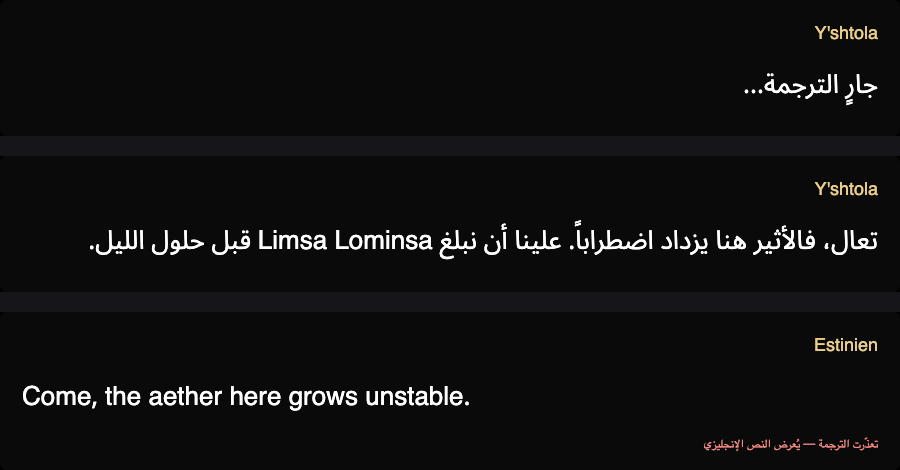

<div align="center">

# GamingTranslatorGlassHUD

**Arabic subtitles for games that never shipped with Arabic support.**

*Games Arabic AI translation — real-time, on screen, without touching the game.*

[English](README.md) · [العربية](README.ar.md)

[](https://github.com/basel2000de/non_arabic_supported_games_llm_hud_translator/actions/workflows/build.yml)
[](LICENSE)
[](https://dotnet.microsoft.com/)

</div>

---

Most games don't support Arabic, and the ones that do rarely translate their story text. Even when
a game's own renderer could be persuaded to show Arabic, it usually can't: without contextual
letter shaping and bidirectional layout you get disconnected letters running the wrong way. So the
fix has to live outside the game.

This reads a rectangle of the screen, runs OCR on it, sends the text to an LLM, and draws the
Arabic back over the game in a separate transparent window. It never touches the game process — no
injection, no memory reads, no modified files, nothing that could put an account at risk.

I built it so my brother could follow the story in games he was otherwise only half understanding.

<div align="center">

<br>
<sub>The overlay in its three states. <b>Screenshots from real gameplay to follow</b> — these are rendered from the actual overlay control.</sub>
</div>

## Status

Early. Honest picture of what works today:

| | |
|---|---|
| Translation pipeline (OCR → normalise → cache → LLM → render) | working, 131 tests |
| Arabic rendering, shaping, bidi, diacritics | working and verified |
| Game profiles, glossary, OCR corrections | working |
| Provider failover, quota tracking, caching | working |
| Screen capture on Windows | **confirmed on real hardware** |
| Overlay rendering over a running game | **confirmed on real hardware** |
| Click-through, hotkeys under game focus, live translation | written, still being tested |

Being tested against **Final Fantasy XIV** on real hardware right now. Screen capture and the
overlay are confirmed working over a live game. The remaining Windows behaviour — clicks passing
through to the game, hotkeys firing while the game holds focus, and the full translation round
trip — is written and building but still going through its first real runs.

I develop on macOS, so everything Windows-specific was written against the API contracts and is
being verified on a borrowed laptop. Expect rough edges for a little while yet.

## How it works

```
capture a rectangle  →  has anything changed?  →  OCR  →  clean up the text
                              ↓ no: stop here
                                                              ↓
   draw Arabic  ←  LLM  ←  add glossary terms  ←  seen this line before?
                                                              ↓ yes: instant, free
```

A few decisions worth calling out, because they're the ones that make it practical:

**Cheap change detection before OCR.** During dialogue, 85–90% of frames are identical to the last
one. Comparing a 64×24 binarised thumbnail first means most frames never reach the OCR engine at
all, which takes a poll from ~120 ms down to ~15 ms. The thumbnail is binarised rather than
compared as grey levels, because dialogue boxes are usually translucent — walk from a dark cave
into bright sunlight and every pixel shifts while the text hasn't changed at all.

**Everything is cached.** Every translated line is stored under a hash of its cleaned-up text. Re-read
a quest, replay a cutscene, roll an alt, and it's free and instant. The cache also means a dropped
connection doesn't blank the screen.

**Two API lanes, not one.** Cutscene dialogue advances every 3–5 seconds, which is right at the free
tier's per-minute ceiling for a single provider. Running Gemini and Groq as parallel lanes and
failing over the moment one is rate-limited roughly triples the headroom.

**Bring your own key.** No key is embedded in the binary. Both providers used have a free tier that
needs no credit card.

## Requirements

- **Windows 10/11** to actually play with it. The game must run **borderless windowed** — exclusive
  fullscreen breaks both screen capture and always-on-top overlays.
- A free API key from [Google AI Studio](https://aistudio.google.com) and/or
  [Groq](https://console.groq.com). No card needed for either.
- Nothing else. Releases are self-contained, so there's no .NET runtime to install.

For development: .NET 10 SDK and `tesseract`. macOS and Linux build and run everything except the
screen-capture and hotkey layer.

## How to use

**1. Get it running.** Download the latest build from
[Actions](https://github.com/basel2000de/non_arabic_supported_games_llm_hud_translator/actions) —
open the newest green run and grab the artifact at the bottom. Unzip it somewhere ordinary like
`C:\glasshud`; keep the whole folder together, since the exe needs `tessdata/`, `profiles/` and
`data/` beside it.

Windows SmartScreen will block it the first time: *More info* → *Run anyway*. That's expected for
an unsigned app with no download history.

**2. Set your game up.** The game must run in **Borderless Windowed**. Exclusive fullscreen breaks
both screen capture and always-on-top overlays, and the app will tell you so rather than showing
you black frames. Also make sure the game isn't running as administrator, or Windows blocks the
overlay from drawing over it.

**3. Add an API key.** Settings → API keys → paste a Gemini or Groq key → Save. They're encrypted
against your Windows account. Both are free and neither needs a card — see [Requirements](#requirements).

**4. Tell it where the text is.** Press `Ctrl+Shift+R`. The screen freezes on a screenshot so
nothing moves while you aim. Drag a box over the dialogue text, press `Space` to see exactly what
the OCR reads from that box, adjust until it reads cleanly, then `Enter` to save. The rectangle is
stored relative to the game window, so it survives the window being moved.

**5. Play.** Press `Ctrl+Shift+T` whenever you want the current line translated. Arabic appears over
the game in about a second — instantly if that line has been seen before.

### Hotkeys

| | |
|---|---|
| `Ctrl+Shift+T` | Translate what's on screen now |
| `Ctrl+Shift+A` | Auto-watch on/off — follows dialogue by itself, good for cutscenes |
| `Ctrl+Shift+H` | Show/hide the overlay (translation keeps running underneath) |
| `Ctrl+Shift+R` | Re-pick the capture region |
| `Ctrl+Shift+F` | Correct the current translation and pin the correction |

All five are rebindable in Settings. Type a combination like `Ctrl+Shift+T`; modifiers are Ctrl,
Shift, Alt and Win, and keys include A–Z, 0–9, F1–F24, arrows, Insert/Delete/Home/End, the numpad
(`Num0`–`Num9`) and punctuation. **F13–F24 are the safest choices** — games almost never bind them.

### Using a mouse button

Mouse buttons can't be bound directly. Windows' `RegisterHotKey` only accepts keyboard keys, and
supporting mouse buttons would mean installing a global input hook — the exact pattern antivirus
heuristics flag, which this project avoids on purpose.

Use your mouse's own software instead (Logitech G HUB, Razer Synapse, Corsair iCUE, SteelSeries GG,
and most generic drivers can all do this). Map the side button to a key combination, then bind that
combination here.

Best combination to use: something with **F13–F24**. Those keys don't exist on physical keyboards,
so no game has anything bound to them and a conflict is impossible.

```
mouse button 4  →  Ctrl+F13   (in your mouse software)
Ctrl+F13        →  Translate what is on screen now   (in Settings → Hotkeys)
```

### Tips

**Auto-watch for cutscenes.** Manual triggering is the default because it costs one request per
line. During a long cutscene, `Ctrl+Shift+A` lets it follow along by itself. It stops automatically
after 90 seconds with no new text, so leaving it on during an AFK can't quietly drain your quota.

**Fix a bad name once.** If a character's name comes out wrong, press `Ctrl+Shift+F`, correct it,
and that correction is pinned — it wins over the model for that line from then on. For a name that
appears constantly, add it to your game's `glossary.json` instead.

**Nothing happening?** Settings shows a status line, a router log, and which OCR engine actually
loaded. Almost every problem is visible there.

**Stuck overlay?** Run `0-force-stop.bat`. The overlay has no Alt-Tab entry and clicks pass through
it, so there's no window to close — the process has to be ended.

## Try the pipeline without a game

```bash
git clone https://github.com/basel2000de/non_arabic_supported_games_llm_hud_translator.git
cd non_arabic_supported_games_llm_hud_translator
dotnet run --project tools/Replay -- --no-cache
```

That runs the full pipeline against generated sample frames using a stub translator, so it needs no
API key, no game, and makes no network calls. It works on macOS and Linux too. You'll see each stage: what the OCR read, how it was cleaned
up, which glossary terms matched, and what came back.

Swap in a real model once you've put a key in Settings:

```bash
dotnet run --project tools/Replay -- --provider gemini
```

Check the Arabic renders correctly on your machine:

```bash
dotnet run --project src/GamingTranslatorGlassHUD.App -f net10.0 -- --render-test
```

## Adding your game

A game profile is a folder. Nothing in the pipeline is specific to any title — what differs is
where the text sits, what the proper nouns are, and how the writing should sound.

```
profiles/
  ffxiv/            ← the reference profile, most complete
    profile.json
    glossary.json
    ocr-corrections.json
  _template/        ← copy this
```

`profile.json` holds the window title to look for, the default text rectangles, and a `styleHint`
that goes straight into the prompt. That last one matters more than it looks — "terse military
radio chatter" and "formal medieval court speech" produce very different Arabic from the same
model.

`glossary.json` pins proper nouns. This is the biggest quality lever available: without it the
model invents a new Arabic spelling of the same character's name every few lines, and inconsistent
names are harder to read past than a slightly clumsy sentence. Only the terms that actually appear
in the current line get sent, so a long glossary costs nothing per request.

`ocr-corrections.json` fixes characters the OCR reliably gets wrong in that game's font. Build it
from the log rather than from guesswork — every raw OCR result is recorded, so the real misreads
are obvious.

Drop the folder in, restart, done. No code change, no rebuild. Profile contributions are very
welcome.

### Why Final Fantasy XIV shows up everywhere

FFXIV is the game I designed and tested against, so it's the reference profile and the example in
most of the docs. It's a good stress case: dense narrative, apostrophe-heavy names that OCR
mangles (`Y'shtola`, `G'raha Tia`), a translucent dialogue box over a moving 3D scene, and text
that reveals character by character. Nothing about the tool is tied to it.

## What it costs

Nothing, in normal use. Rough arithmetic for a heavy story session:

| | per hour |
|---|---|
| Lines of dialogue in cutscene-dense play | 100–200 |
| API requests after cache hits | ~120 |
| Free-tier daily budget across both providers | ~15,000 |

You'd need to play for well over a day straight to run out. The realistic way to burn quota isn't
long sessions — it's a bug where the same line hashes two different ways and gets paid for twice,
which is why so much care goes into normalising text before hashing it.

## Contributing

Issues and pull requests welcome. The most useful contributions right now:

- **Game profiles.** You don't need to write any C# — a folder with three JSON files.
- **Arabic review.** The FFXIV glossary is a starting point and would benefit from a native
  speaker's eye. Consistency matters more than any individual word choice.
- **Testing the Windows layer.** It is written but unverified on real hardware. Bug reports with
  the router log attached are worth a lot right now.

[CLAUDE.md](CLAUDE.md) is the orientation doc for anyone about to change code. It lists the
constraints that aren't obvious from reading it, and a few rules that look like style preferences
but are actually correctness (setting a line height on Arabic text silently clips diacritics, for
instance, and clipping the dots under `ي` turns it into a different letter).

## Not on the roadmap, deliberately

No game-process injection, no memory reading, no plugin frameworks. Those risk accounts and break
on every patch. Reading pixels off the screen has no relationship to the game client at all.

No classic machine-translation APIs either. They're worse on every axis that matters here — smaller
free tiers, no glossary support on free plans, no context between lines, and they flatten a game's
voice into generic prose.

## Credits

Built and directed by **[Basel](https://github.com/basel2000de)** — architecture, design decisions,
provider and quota strategy, debugging, and the calls on what to fix and how.

Implementation was written with AI coding assistance (Claude), working to that direction.

Bundled: [Noto Sans Arabic](https://github.com/notofonts/arabic) under the SIL Open Font License.
Built on [Tesseract](https://github.com/tesseract-ocr/tesseract), [Avalonia](https://avaloniaui.net/),
and [SkiaSharp](https://github.com/mono/SkiaSharp). See [NOTICE](NOTICE).

## Licence

[Apache License 2.0](LICENSE).
