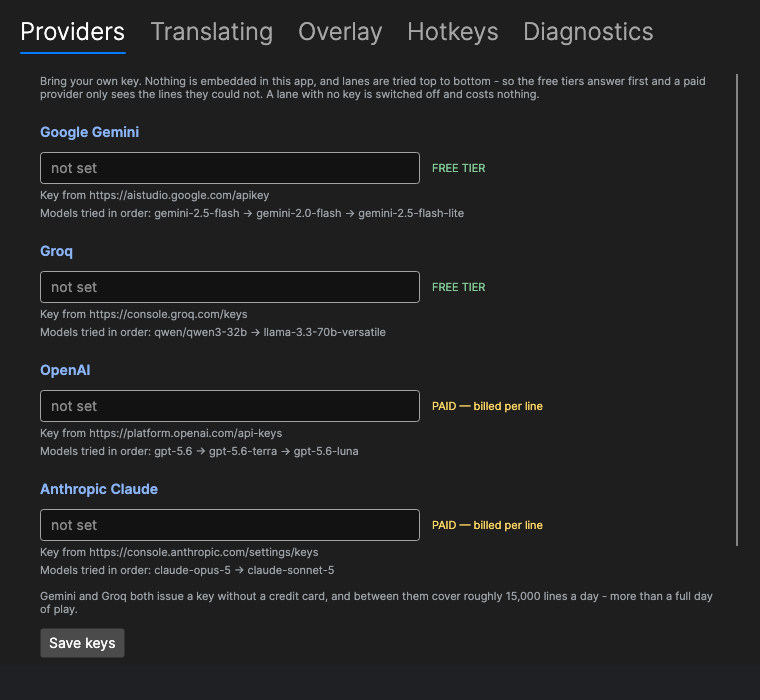
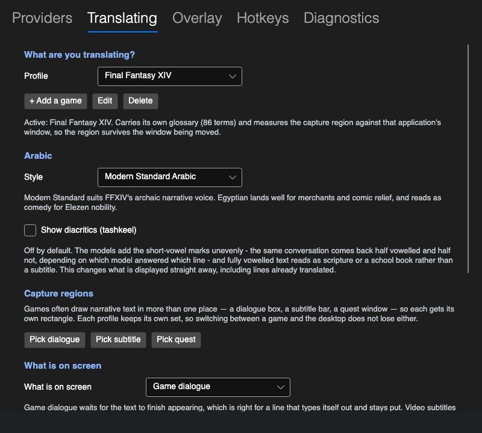
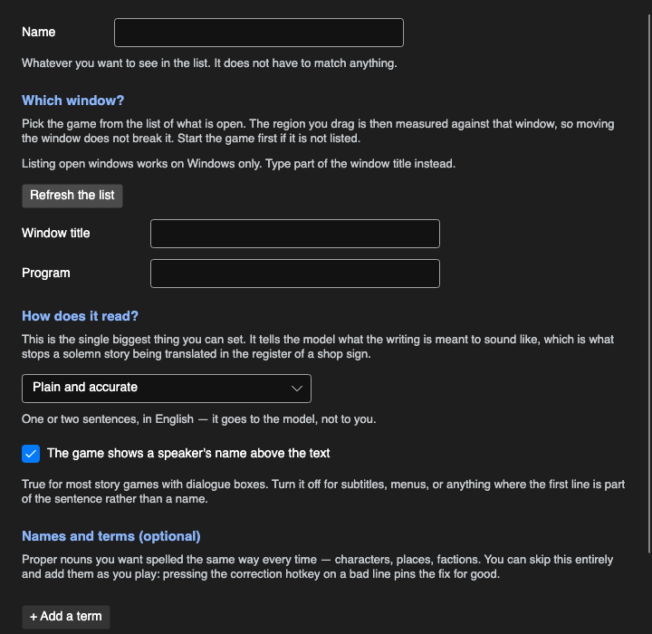
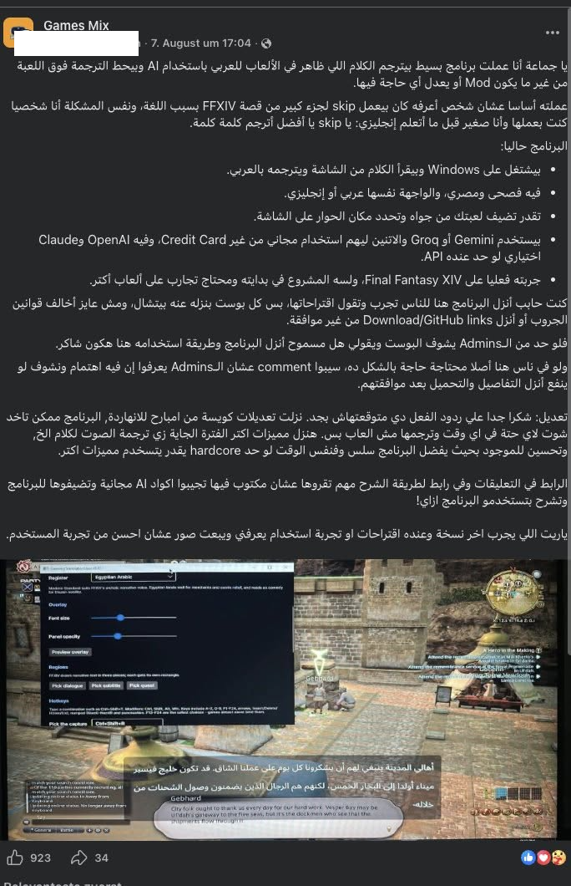

<div align="center">

# Glass HUD Translator

**Arabic subtitles for games that never shipped with Arabic support.**

*Games Arabic AI translation — real-time, on screen, without touching the game.*

[English](README.md) · [العربية](README.ar.md) · [مصري](README.masri.md) · [Deutsch](README.de.md)

[](https://github.com/basel2000de/glass_hud_translator/actions/workflows/build.yml)
[](LICENSE)
[](https://dotnet.microsoft.com/)

</div>

---

Most games don't support Arabic, and the ones that do rarely translate their story. Glass HUD
Translator reads a rectangle of your screen, runs OCR on it, translates the text with an AI model,
and draws the Arabic back over the game in a transparent window.

It never touches the game process — no injection, no memory reads, no modified files. It reads
pixels, the same way a screenshot does, so there is nothing in it that can put an account at risk.

I built it for someone who reads Arabic far more comfortably than English, and who was following
maybe half the story in a game that is almost entirely story.

<div align="center">

<br>
<sub>Running over Final Fantasy XIV. The game's English dialogue is at the bottom; the Arabic is drawn above it.</sub>
</div>

### See it running

<div align="center">


<sub>Fifty seconds in Final Fantasy XIV: pressing the hotkey line by line, then switching to auto-watch and letting it follow the conversation on its own.</sub>

<br>


<sub>Auto-watch alone, during a cutscene — nothing to press.</sub>

</div>

## Get started

You need **Windows 10 or 11**, a game running in **borderless windowed** mode, and one API key.
Nothing else — the download is self-contained, so there is no .NET runtime to install.

A free key from [Google AI Studio](https://aistudio.google.com) or
[Groq](https://console.groq.com) is enough, and neither asks for a credit card. If you already pay
for [OpenAI](https://platform.openai.com/api-keys) or
[Anthropic](https://console.anthropic.com/settings/keys), you can use that key instead.

**1. Download and unzip.** Take the zip from
[Releases](https://github.com/basel2000de/glass_hud_translator/releases)
and unzip it somewhere ordinary like `C:\glasshud`. Keep the folder together — the exe needs
`tessdata/`, `profiles/` and `data/` beside it.

Windows SmartScreen will block it the first time: *More info* → *Run anyway*. That is normal for an
unsigned app with no download history.

**2. Set the game to Borderless Windowed.** Exclusive fullscreen breaks screen capture and
always-on-top overlays both. Don't run the game as administrator either, or Windows won't let the
overlay draw over it.

**3. Paste in a key.** Settings → **Providers** → paste → Save. Keys are encrypted against your
Windows account. Each provider shows whether it's free or billed per line, and where to get a key.
Any provider you leave blank is switched off.

You can add up to three keys per provider with **+ Add another key**. They're tried in order before
moving on to the next provider, so all your Google keys are used before Groq is touched. One thing
decides whether that's worth doing: a free allowance belongs to the **account**, not the key — two
keys from the same Google account share one allowance and buy you nothing. A second key only helps
if it comes from a second account.

The first control on that tab is the interface language, labelled **Language · اللغة** in both
scripts so it's findable either way. The whole interface is available in Arabic, right-to-left —
see [below](#the-interface-speaks-arabic-too).

<div align="center">

</div>

**4. Show it where the text is.** Press `Ctrl+Shift+R`. The screen freezes on a screenshot so
nothing moves while you aim. Drag a box over the dialogue text, press `Space` to see exactly what
the OCR reads from it, adjust until it reads cleanly, then `Enter`. The rectangle is stored relative
to the game window, so moving the window doesn't break it.

**5. Play.** Press `Ctrl+Shift+T` for the line currently on screen. The Arabic appears in about a
second, or instantly if that line has been seen before.

### Hotkeys

| | |
|---|---|
| `Ctrl+Shift+T` | Translate what's on screen now |
| `Ctrl+Shift+A` | Auto-watch on/off — follows dialogue by itself, good for cutscenes |
| `Ctrl+Shift+H` | Show/hide the overlay (translation keeps running underneath) |
| `Ctrl+Shift+R` | Re-pick the capture region |
| `Ctrl+Shift+F` | Correct the current translation and pin the correction |
| `Ctrl+Shift+S` | Open Settings without leaving the game |
| `Ctrl+Shift+X` | Translate one thing once — drag a box around anything on screen |

All seven are rebindable in Settings → **Hotkeys**. Modifiers are Ctrl, Shift, Alt and Win; keys
include A–Z, 0–9, F1–F24, arrows, Insert/Delete/Home/End, the numpad and punctuation.

You don't have to remember any of them. There's a toolbar — see below.

**F13–F24 are the safest choices.** They don't exist on physical keyboards, so no game has anything
bound to them.

### Using a mouse button

Mouse buttons can't be bound directly. Windows' `RegisterHotKey` only accepts keyboard keys, and
supporting mouse buttons would mean installing a global input hook — the exact pattern antivirus
heuristics flag, which this project avoids on purpose.

Use your mouse's own software instead (G HUB, Synapse, iCUE, SteelSeries GG and most generic
drivers can all do this). Map the side button to a key combination, then bind that combination here:

```
mouse button 4  →  Ctrl+F13   (in your mouse software)
Ctrl+F13        →  Translate what is on screen now   (in Settings → Hotkeys)
```

### The toolbar

A small strip of buttons that stays over the game, for everything you'd otherwise need a hotkey or
the Settings window for. Six to start with — translate now, watch automatically, translate one
thing, choose the region, hide the translation, settings — and one more that opens the rest: the
capture outline, the dialogue/video switch, the vowel marks, pin a correction, quit.

Drag it by the dots on its left edge, anywhere you like; it remembers where. Shrink it to a single
handle with the button on its right. Switch it off entirely in Settings → **Overlay** if you'd
rather work from the hotkeys.

**Hover any button and it tells you what it does in Arabic and English at once**, whichever language
the interface is set to. A toolbar has no words on it, only shapes — so a label in one language
leaves someone guessing, and it's a coin flip which someone: the friend helping with the setup, or
the person this was built for.

### Seeing what's being captured

Settings → **Overlay** → *Show what is being captured* draws a thin outline around the rectangle
being read. It's the answer to "is it even looking at the right place", which is otherwise a guess.

Clicks pass straight through it, so it doesn't get in the way of playing. Press the toolbar's frame
button again and it becomes grabbable: drag the middle to move it, a corner to resize. It saves the
moment you let go — there's no confirm step, because what you're editing is already showing you the
result.

It can't end up inside the text it's outlining. The border is drawn on the outside of the rectangle,
and like the translation panel it's invisible to every screen capture including this app's own.

### Translating one thing

`Ctrl+Shift+X`, or the third toolbar button. Drag a box around anything — an item tooltip, a sign, a
name in a menu — and it's translated the moment you let go.

It doesn't disturb what the app was already doing. Automatic mode keeps running and comes straight
back to the line it was watching, and the one-off stays out of the conversation in both directions:
an item description shouldn't be coloured by the dialogue you were just reading, and it certainly
shouldn't steer the pronouns of the next line.

### Tips

**Check the key before you play.** Each key box has a **Test** button beside it. It sends one very
short line through that provider, so you find out here rather than in a cutscene. It distinguishes
"the key was refused" from "I could not check right now" — those need opposite responses, and only
the first means you need a new key. A key that passes is saved immediately.

**Move the overlay if it covers something.** Settings → **Overlay** has two position sliders and
the panel moves as you drag them. Its position is measured inside the game's window, so it stays
put when the game moves or changes monitor.

**Auto-watch for cutscenes.** Manual triggering is the default because each line costs a request.
During a long cutscene, `Ctrl+Shift+A` lets it follow along by itself. It waits for the text to stop
moving before translating, so a line that types itself out on screen costs one request rather than
one per revealed chunk.

It tells you on the overlay after two minutes that it is still on and what it has spent, and
switches itself off after four — or sooner if it has spent more than four minutes of dialogue
normally would. There is a switch in Settings to let it run without a limit.

**Watching a video? Say so.** Settings → **Hotkeys** → *What is on screen*. Subtitles appear whole
and leave after a few seconds, so waiting for the text to settle — right for a game that types
dialogue out one character at a time — means the Arabic lands after the line has gone. Measured on a
moving picture, that wait was 4.6 seconds against a subtitle that lives three. Video mode checks
more often and waits far less. It also costs far more: roughly one request per subtitle, so a film
is a large slice of a day's free allowance rather than a rounding error.

**It works out the pace on its own.** The app times the gaps between lines and tightens its own
deadline to match, so a slow dialogue box and a fast subtitle track get different timings without
you choosing. Diagnostics shows what it has worked out — and if the text really is arriving faster
than it can be translated, it says so rather than quietly skipping lines.

**Fix a bad name once.** If a character's name comes out wrong, press `Ctrl+Shift+F` and correct
it. That correction is pinned and beats the model for that line from then on. For a name that
appears constantly, add it to your game's `glossary.json` instead.

**Nothing happening?** Settings → **Diagnostics** shows the quota used today, the cache hit rate,
which OCR engine loaded, and a router log naming any provider or model that failed. Settings →
**Providers** lists the lanes in the order they'll be tried and flags any with no key.

**Stuck overlay?** Run `0-force-stop.bat`. The overlay has no Alt-Tab entry and clicks pass through
it, so there is no window to close — the process has to be ended.

## Updates

Once a day the app asks GitHub whether a newer release exists, and if there is one, Settings opens
with a notice naming the file to download and what to do with it. That is the whole feature — it
never downloads or installs anything by itself.

<div align="center">

<br>
<sub>What a new release looks like. The filename is read from the release itself, so it names a file that exists.</sub>
</div>

**Updating is a manual replace, on purpose.** Unzip the new version somewhere, run it, and delete
the old folder once it works. Self-updating was considered and rejected: Windows won't let a running
program overwrite its own libraries, the build is unsigned so an app that downloads and runs another
executable is the exact pattern antivirus heuristics flag, and a self-updater that goes wrong leaves
someone with an install that no longer starts and an English error message they may not read.

**Your setup survives.** API keys, settings, capture regions and the translation cache live under
your Windows account, not in the app folder. Anything you edited inside `profiles/` or
`data/models.json` does not carry over — copy those across if you changed them.

**It is the only request this app makes that isn't a translation.** Nothing is sent with it: no
identifier, no usage data, no key — just a plain GET to GitHub's public releases endpoint, the same
one your browser would hit. It's on by default because the person this was built for isn't going to
be watching a repository for tags. Turn it off in Settings → **Diagnostics** → **Updates** and
nothing is sent at all.

## The interface speaks Arabic too

The app exists for people who read Arabic more comfortably than English, so an English-only
interface was the wrong way round: the person who most needs it was the one least able to set it
up. Switch it in Settings → Providers → **Language · اللغة**. The whole window mirrors — tabs,
labels, layout — and it uses the bundled Arabic font rather than hoping Windows has one.

English stays the default, since that's what this documentation shows.

The Arabic has since been through a round of review by a native speaker, which is the only way this
kind of thing gets found. Three buttons still read `حدد dialogue` — the region names are stored
English keys, and gluing one onto a translated verb leaves half an interface. The API key field said
`غير محدَّد`, which sounds like the setting's value is unknown rather than that you haven't pasted a
key yet. The dialect selector was labelled "المستوى اللغوي", a linguist's term for a choice between
two named dialects. And the grey explanatory notes were sized as though nobody needed to read them,
when they are exactly what a non-technical user has to read to finish setup.

<div align="center">

<br>
<sub>The same tab in Arabic. Keys, URLs and model names stay left-to-right, because they are not words.</sub>
</div>

## What you're configuring

<div align="center">

<br>
<sub>Which game, which dialect, and where on screen the text sits. Each profile keeps its own regions.</sub>
</div>

<br>

**Two dialects, and the difference is not cosmetic.** Modern Standard is the default and suits
FFXIV's deliberately archaic narrative voice. Egyptian is what most Arabic speakers actually talk
in, and it lands far better for merchants, banter and comic relief — though it reads as comedy on
the lips of Elezen nobility, which is either a problem or the point.

<div align="center">

<br>
<sub>The same overlay set to Egyptian Arabic. One line of the prompt changes; nothing else does.</sub>
</div>

<br>

**Diacritics are off by default.** The models add the short-vowel marks (تشكيل) unevenly — the same
conversation comes back half vowelled and half not, depending on which model answered which line —
and fully vowelled text reads as scripture or a school book rather than a subtitle. There's a switch
on the Translating tab if you want them. It changes what's on screen straight away, including lines
already translated.

<br>

<div align="center">

<br>
<sub>Diagnostics, running on Windows. The router log here has caught Google retiring a model
mid-session; it fell through to the next one and carried on translating.</sub>
</div>

<br>

<div align="center">

<br>
<sub>Not only games. The same overlay reading a browser, using the <code>general</code> profile.</sub>
</div>

## Status

Early, but working.

| | |
|---|---|
| Translation pipeline (OCR → normalise → cache → LLM → render) | working, 573 tests |
| Arabic rendering, shaping, bidi, diacritics | working and verified |
| Game profiles, glossary, OCR corrections | working |
| Provider failover, quota tracking, caching | working |
| Screen capture, OCR, global hotkeys | **working on Windows** |
| Overlay drawn over a running game | **working** |
| End-to-end translation in game | **working** — about 1 second per line |
| Checking an API key from Settings | **working** |
| Moving the overlay where you want it | **working** |
| A game on a second monitor | **working** |
| Display scaling above 100% | **working** |
| More than one key per provider | **working** |
| Diacritics on or off | **working** |
| A limit on automatic mode | **working** |
| Video subtitle mode | **working**, not yet measured against a long film |
| Recording the overlay | **working** — off by default, see Settings → Overlay |
| Not paying twice for the same line misread | **working** |
| The floating toolbar | written, not yet run on Windows |
| The visible capture outline | written, not yet run on Windows |
| Translate one thing once | written, not yet run on Windows |
| Click-through | not yet verified |

Tested against **Final Fantasy XIV** and several other games on Windows across a long session:
capture, OCR, hotkeys, the overlay and the full round trip run against the live game at roughly a
second a line, across two monitors and at more than one display scale.

Expect rough edges. Click-through is still unverified, the glossary is a first draft, and OCR
accuracy against a real game font hasn't been measured properly. I develop on macOS and test on a
Windows machine, so Windows fixes arrive in batches — which is why "written" and "verified" are
separate rows above.

**Automatic mode has a limit now**, measured from when you switch it on rather than from the last
time anything changed — the old rule counted only time with *no new text at all*, so on a video, or
in a game with animation behind the dialogue, it never fired once. It warns on the overlay at two
minutes and stops at four, by time or by spend, whichever arrives first. You can switch the limit
off if you want to.

**The three window features are the newest thing here and the least proven.** The toolbar, the
capture outline and the one-off translation were all written and rendered on macOS, and the piece
that can't be rehearsed there is whether a window that refuses to take keyboard focus still receives
mouse clicks on Windows. Everything that would have depended on focus is avoided on purpose — the
toolbar moves itself rather than asking the window manager to, the outline saves on release rather
than on Enter, and neither takes a keystroke. If the toolbar turns out not to respond at all,
Settings → **Overlay** → *Toolbar may take focus* is the fix, and it's worded that way because
that's the symptom you'd see.

**Free models retire without warning, and both providers did it in the same week.** Model names
live in [`data/models.json`](data/models.json), never in code, so when a provider drops one the fix
is editing a text file rather than waiting for a release. If translation stops and the Diagnostics
tab says `MODEL GONE`, that is what happened.

## How it works

```
capture a rectangle  →  has the picture changed?  →  OCR  →  clean up the text
                              ↓ no: stop here                        ↓
                                                    is this the same line as before?
                                                                     ↓ no
   draw Arabic  ←  LLM  ←  add glossary terms  ←  seen this line before?
                                                              ↓ yes: instant, free
```

Five things make it practical:

**Change detection before OCR.** During dialogue, 85–90% of frames are identical to the last one.
Comparing a 64×24 binarised thumbnail first keeps most frames away from the OCR engine entirely,
taking a poll from ~120 ms down to ~15 ms. The thumbnail is binarised rather than compared as grey
levels because dialogue boxes are usually translucent: walk from a dark cave into sunlight and
every pixel shifts while the text hasn't changed at all.

**And a second check after OCR, on the words rather than the picture.** Comparing pictures can't
help with a subtitle burnt into moving footage — the film behind it changes every frame while the
words don't. And text recognition isn't perfectly repeatable anyway: the same pixels a moment later
come back with a comma turned into a full stop, which is a different line as far as the cache is
concerned, so it gets translated again and paid for again. A line within a few characters of the one
already on screen is dropped before anything is sent. Short labels have to match exactly — "yes" and
"no" are three characters apart and are not the same word.

**Everything is cached.** Each translated line is stored under a hash of its cleaned-up text. Re-read
a quest, replay a cutscene, roll an alt, and it's free and instant. A dropped connection doesn't
blank the screen either.

**Parallel API lanes.** Cutscene dialogue advances every 3–5 seconds, right at the free tier's
per-minute ceiling for a single provider. Running Gemini and Groq as parallel lanes and failing
over the moment one is rate-limited roughly triples the headroom.

**Free first, paid only if you want it.** Four providers ship. Lanes are tried in the order they
appear in `data/models.json`, so the free tiers answer first and a paid provider only ever sees the
lines they couldn't. A lane with no key is switched off and costs nothing.

| | | |
|---|---|---|
| Google Gemini | free tier | no card required |
| Groq | free tier | no card required |
| OpenAI | paid | for people who already have a key |
| Anthropic Claude | paid | for people who already have a key |

No key is embedded in the app. Bring your own.

## Adding your game

Settings → **Translating** → **+ Add a game**. No files, no restart.

<div align="center">

<br>
<sub>Pick the game from the windows you have open. Everything else has a sensible default.</sub>
</div>

Three questions, and only the first two matter:

**Which window.** Pick your game from the list of what's open — the region you drag is then measured
against that window, so moving it doesn't break anything. It records the program name as well as the
title, because titles change while a game runs and `ffxiv_dx11.exe` doesn't. Leave it on *anything on
screen* for a browser or a video player.

**How it reads.** A dropdown: plain, serious fantasy, modern and casual, funny, menus and numbers.
This does more than it looks like it should — the same model produces very different Arabic for
"terse military radio chatter" than for "formal medieval court speech". There's a free-text box if
you want to write your own.

**Names and terms**, which is optional and worth skipping at first. Proper nouns spelled the same
way every time is the single biggest quality lever, but you don't have to think of them up front:
press `Ctrl+Shift+F` on a line that got a name wrong and the fix is pinned for good.

Saving takes you straight to picking the capture region, since a profile without one doesn't do
anything yet.

**Edit** and **Delete** sit next to it. Editing a profile that shipped with the app saves your copy
separately, so an update can't overwrite your work and the original keeps improving underneath.
*Anything on screen* is the one you can't remove — it's the fallback that works on everything.

### Where it's kept, and sharing it

A profile is still just a folder of three text files, which is what makes it shareable — one person
setting up a game properly is enough for everyone else playing it:

```
profile.json           the window to attach to, the voice, the starting rectangles
glossary.json          proper nouns and their Arabic spellings
ocr-corrections.json   characters the OCR reliably gets wrong in that game's font
```

Yours live in `%APPDATA%\GlassHudTranslator\profiles\`, deliberately **not** in the app folder — that
one gets replaced when you update, and your game setup would go with it. The ones bundled with the
app are still under `profiles/`, and `profiles/_template/` is there if you'd rather write one by
hand. Profile contributions are very welcome.

### It isn't only for games

The capture reads pixels off the desktop, not out of a game process. Switch the profile to
**general** in Settings and the region is measured against the whole screen instead of one
application's window, which makes it work on a browser, a PDF, a video player's subtitle bar, a
chat client, or anything else on screen.

| | game profile | `general` |
|---|---|---|
| Region measured against | the game's window | the whole screen |
| Survives the window being moved | yes | no — repick if you move things |
| Glossary of proper nouns | yes | none by default |
| Prompt voice | tuned per game | plain contemporary prose |

Each profile keeps its own capture regions, so picking the dialogue box once for a game and the
subtitle bar once for a video player is enough — switching between them restores the right rectangle
with no re-picking and no restart.

Use `general` for reading something once; make a game profile for anything you come back to.

### Why Final Fantasy XIV shows up everywhere

FFXIV is what I designed and tested against, so it's the reference profile and the example in most
of the docs. It's a good stress case: dense narrative, apostrophe-heavy names that OCR mangles
(`Y'shtola`, `G'raha Tia`), a translucent dialogue box over a moving 3D scene, and text that
reveals character by character. Nothing about the tool is tied to it.

## What it costs

Nothing, in normal use. Rough arithmetic for a heavy story session:

| | per hour |
|---|---|
| Lines of dialogue in cutscene-dense play | 100–200 |
| API requests after cache hits | ~120 |
| Free-tier daily budget across both free providers | ~3,500 translations |
| The same again, per extra account you add a key for | ~3,500 |

You would need to play for well over a day straight to run out. The realistic way to burn quota
isn't long sessions — it's a bug where the same line hashes two different ways and gets paid for
twice, which is why so much care goes into normalising text before hashing it. Two of those have
been found and fixed so far: one line becoming several while it typed itself onto the screen, and
Groq refusing every second request in a minute because this app was reserving half its per-minute
token allowance on each one.

## Try it without a game

```bash
git clone https://github.com/basel2000de/glass_hud_translator.git
cd glass_hud_translator
dotnet run --project tools/Replay -- --no-cache
```

That runs the full pipeline against generated sample frames with a stub translator: no API key, no
game, no network calls, and it works on macOS and Linux too. You'll see each stage — what the OCR
read, how it was cleaned up, which glossary terms matched, and what came back.

Swap in a real model once you've saved a key:

```bash
dotnet run --project tools/Replay -- --provider gemini
```

Check that Arabic renders correctly on your machine:

```bash
dotnet run --project src/GlassHudTranslator.App -f net10.0 -- --render-test
```

## Where the feedback comes from

There is no bug tracker for this project in any useful sense. The people it is for do not have
GitHub accounts, and asking them to open an issue would be asking them to learn a tool harder than
the one they came for. So it gets posted in Arabic gaming groups instead, and the comment thread is
the bug tracker.

<div align="center">

<br>
<sub>The post that most of the current users came from — over nine hundred reactions, a few hundred
comments, and around five hundred downloads of the release it pointed at.</sub>
</div>

<br>

That is also where nearly everything in the recent releases came from, and none of it arrived as a
bug report. It arrived as someone describing a symptom in their own words — *the translation covers
the text I need to read*, *it says translation failed but my key works* — which is a harder thing to
diagnose and a much better thing to receive, because it is the actual experience rather than
somebody's theory about the cause. The overlay position sliders, the key that tested successfully
without ever being saved, and Groq being throttled by this app rather than by Groq all started that
way.

It is why the documentation is shaped the way it is: three readmes, one of them a plain
Egyptian-Arabic manual with no jargon in it, and an interface that can be switched to Arabic before
you have entered anything. Someone who cannot read the setup instructions has not been given a tool.

And the personal reason, since open source usually has one: game subtitles and overlays are a large
part of how I learned English as a child, at an age when nothing else would have held my attention
for that many hours. If this gives a few people a better time in their own language, that is the
debt paid in the direction it can be paid.

## Contributing

Issues and pull requests welcome — see [CONTRIBUTING.md](CONTRIBUTING.md). Most useful right now:

- **Arabic review.** The FFXIV glossary is a first draft and would benefit from a native speaker's
  eye. Consistency matters more than any individual word choice. This is the single most valuable
  contribution anyone can make.
- **Game profiles.** No C# required — a folder with three JSON files.
- **Bug reports from real play.** It has been tested against one game on one machine. Reports with
  the router log attached are worth a lot.

[CLAUDE.md](CLAUDE.md) is the orientation doc for anyone about to change code. It lists the
constraints that aren't obvious from reading it, and a few rules that look like style preferences
but are correctness — setting a line height on Arabic text silently clips diacritics, and clipping
the dots under `ي` turns it into a different letter.

## Not on the roadmap, deliberately

No game-process injection, no memory reading, no plugin frameworks. Those risk accounts and break
on every patch. Reading pixels off the screen has no relationship to the game client at all.

No classic machine-translation APIs either. They're worse on every axis that matters here: smaller
free tiers, no glossary support on free plans, no context between lines, and they flatten a game's
voice into generic prose.

## Credits

Built and directed by **[Basel](https://github.com/basel2000de)** — architecture, design decisions,
provider and quota strategy, debugging, and the calls on what to fix and how.

Implementation was written with AI coding assistance (Claude), working to that direction.

Bundled: [Noto Sans Arabic](https://github.com/notofonts/arabic) under the SIL Open Font License.
Built on [Tesseract](https://github.com/tesseract-ocr/tesseract), [Avalonia](https://avaloniaui.net/),
and [SkiaSharp](https://github.com/mono/SkiaSharp). See [NOTICE](NOTICE).

## Licence

[GNU AGPL 3.0](LICENSE), from v0.6.0 onward. Free to use, study, modify and share — the one
condition is that anything built on it stays open the same way. If you distribute a modified
version, or run one where other people can use it over a network, the people using it are entitled
to your source too.

**Everything up to and including v0.5.3 remains Apache 2.0**, and that cannot be taken back. If you
prefer those terms, that code is still there under its tag and still yours to use however you like.

The change is not about money — nobody is being charged for anything here, and every provider key is
your own. It is about the work staying available to the people it was written for. A translator for
readers who have been left out of their own games should not be something that can be taken closed,
reskinned, and sold back to them.
